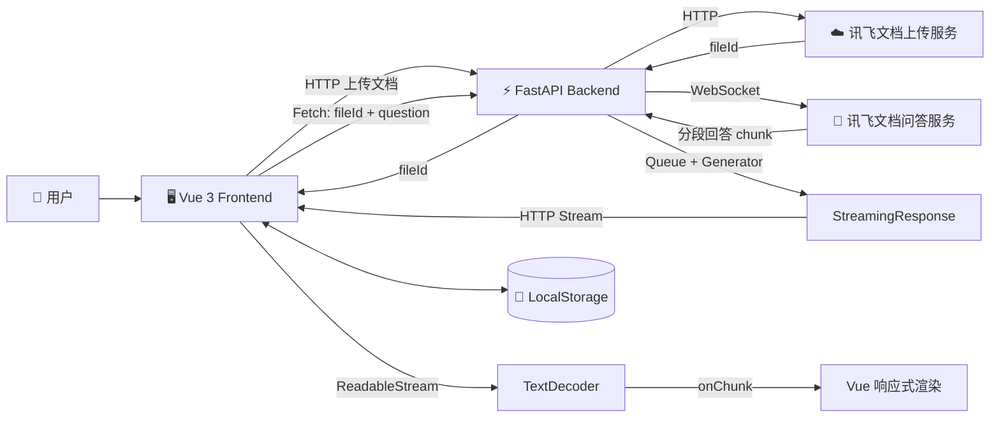

<div align="center">

# 📚 RAG 智能文档问答系统

**基于 Vue 3 + FastAPI + 讯飞文档问答服务实现的流式智能文档问答应用**


</div>

---

## ✨ 项目简介

本项目面向 **“基于本地文档进行智能问答”** 的使用场景。

用户上传本地文档后，Vue 前端将文件提交至 FastAPI 后端，由后端调用讯飞文档服务完成文档上传，并获取对应的 `fileId`。

用户随后可以围绕指定文档进行提问，FastAPI 后端根据：

```text
fileId + question
```

调用讯飞文档问答服务。

在问答过程中，第三方服务通过 WebSocket 分段返回模型结果，后端使用 `Queue + Generator + StreamingResponse` 将回答转换为 HTTP 流式响应；前端通过 Fetch API 的 `ReadableStream` 持续读取数据，并利用 Vue 响应式机制实时更新 AI 消息内容，实现类似 AI 聊天应用的逐步回答效果。

当前项目已经形成完整链路：

```text
文档上传
    ↓
获取 fileId
    ↓
基于指定文档提问
    ↓
WebSocket 获取模型分段回答
    ↓
FastAPI 流式转发
    ↓
前端 ReadableStream 持续读取
    ↓
Vue 增量渲染 AI 回答
```

> 当前版本的文档解析、检索和生成能力主要由讯飞文档问答服务提供。
>
> 本项目重点实现 AI 服务接入、前后端业务链路、流式通信以及前端交互能力。

---

## 🚀 核心功能

### 📄 多格式文档上传

- 支持 PDF、DOC / DOCX、TXT、MD 等常见文档格式
- 支持用户选择并上传本地文档
- FastAPI 后端负责转发文档到讯飞文档服务
- 上传成功后获取并保存对应的 `fileId`
- 后续问答通过 `fileId` 关联指定文档

### 💬 基于文档的智能问答

- 用户可以围绕当前文档内容进行提问
- 前端发送 `fileId + question`
- 后端通过 WebSocket 调用讯飞文档问答服务
- 根据指定文档内容生成回答

### ⚡ AI 回答流式输出

项目已实现完整的流式问答链路。

后端：

```text
讯飞 WebSocket
    ↓
on_message
    ↓
Queue
    ↓
Generator
    ↓
StreamingResponse
```

前端：

```text
Fetch
    ↓
response.body
    ↓
ReadableStream
    ↓
getReader()
    ↓
reader.read()
    ↓
TextDecoder
    ↓
Vue 响应式更新
```

AI 回答无需等待完整内容生成后再一次性显示，而是随着模型内容返回持续更新页面。

### 🗂️ 历史文档管理

- 使用 LocalStorage 保存历史文档记录
- 支持查看已上传文档
- 支持切换历史文档
- 可以基于历史文档继续进行问答

### 🕘 对话记录

- 展示用户问题与 AI 回答
- 保存当前问答历史
- 支持清空当前对话
- 流式回答过程中持续更新同一条 AI 消息

### 🌓 页面交互

- 响应式页面布局
- 支持深色 / 浅色模式
- 文档上传与问答区域分区展示
- AI 生成过程中提供 Loading 状态
- 回答生成时自动滚动至最新内容

### 🧩 后端接口调试

- 基于 FastAPI 提供 REST API
- FastAPI 自动生成 Swagger API 文档
- 支持通过 Swagger 测试文档上传和问答接口
- 支持通过 curl 验证普通响应与流式响应差异

---

## 🛠️ 技术栈

| 层级 | 技术 |
| --- | --- |
| Frontend | Vue 3、Vite、JavaScript、Fetch API、ReadableStream、TextDecoder、CSS3、LocalStorage |
| Backend | Python、FastAPI、Uvicorn、StreamingResponse |
| Concurrency | Queue、Threading、Generator |
| Network | HTTP、Streaming HTTP、WebSocket |
| AI / RAG | 讯飞文档问答服务 |
| Engineering | Git、GitHub、`.env`、Swagger |

---

## 🏗️ 系统架构



---

## 🔄 核心业务流程

### 📤 文档上传流程

```text
用户选择文档
    ↓
Vue 3 前端
    ↓
Fetch / HTTP
    ↓
POST /api/upload-document
    ↓
FastAPI
    ↓
Document_Upload
    ↓
讯飞文档上传服务
    ↓
返回 fileId
    ↓
前端保存当前文档信息
```

### 💬 普通文档问答流程

项目保留普通问答接口，用于完整响应模式：

```text
用户输入问题
    ↓
Vue / HTTP
    ↓
POST /api/qa-document
    ↓
FastAPI
    ↓
Document_Q_And_A
    ↓
WebSocket
    ↓
讯飞文档问答服务
    ↓
后端聚合完整回答
    ↓
返回完整 JSON
```

### ⚡ 流式文档问答流程

当前前端主要使用流式问答接口：

```text
用户输入问题
    ↓
DocumentQA.vue
    ↓
apiService.askQuestionStream()
    ↓
Fetch
    ↓
POST /api/qa-document-stream
    ↓
FastAPI
    ↓
Document_Q_And_A
    ↓
WebSocket
    ↓
讯飞文档问答服务
    ↓
分段返回回答
    ↓
on_message
    ↓
Queue.put(content)
    ↓
Generator
    ↓
yield chunk
    ↓
StreamingResponse
    ↓
HTTP Stream
    ↓
response.body.getReader()
    ↓
reader.read()
    ↓
TextDecoder
    ↓
onChunk(chunk, fullText)
    ↓
更新 conversation 中的 AI Message
    ↓
Vue 响应式增量渲染
```

---

## ⚡ 流式响应实现

### 后端流式转发

讯飞文档问答服务本身通过 WebSocket 分段返回回答。

如果等待 WebSocket 全部结束后再拼接结果：

```text
chunk
chunk
chunk
    ↓
result_buffer
    ↓
完整 answer
    ↓
HTTP Response
```

用户只能在整个回答生成结束后看到内容。

因此项目新增流式处理机制。

WebSocket 回调函数作为数据生产者：

```python
message_queue.put(content)
```

将模型返回的数据持续放入线程安全的 Queue。

Generator 作为数据消费者：

```python
item = message_queue.get()

yield item
```

持续从 Queue 获取数据。

FastAPI 使用：

```python
StreamingResponse
```

将 Generator 产生的数据不断发送给浏览器。

整体形成：

```text
WebSocket Thread
       ↓
    Producer
       ↓
     Queue
       ↓
    Consumer
       ↓
   Generator
       ↓
StreamingResponse
```

---

## 🌊 前端流式读取

前端通过 Fetch API 获取流式响应：

```javascript
const response = await fetch(url, options);
```

随后获取响应体：

```javascript
const reader = response.body.getReader();
```

不断读取服务器返回的数据：

```javascript
const { done, value } = await reader.read();
```

其中：

```text
done = false
```

表示数据流尚未结束。

```text
done = true
```

表示服务端已经完成流式输出。

`value` 为 `Uint8Array` 字节数据，因此通过：

```javascript
const decoder = new TextDecoder('utf-8');
```

进行 UTF-8 解码：

```javascript
const chunk = decoder.decode(value, {
  stream: true
});
```

每获取一段内容后持续拼接：

```javascript
fullText += chunk;
```

并通过：

```javascript
onChunk(chunk, fullText);
```

通知 Vue 页面更新。

---

## 🖥️ Vue 增量渲染

用户发送问题后，页面首先创建一条空的 AI Message：

```javascript
{
  type: 'ai',
  content: ''
}
```

之后每收到新的流式内容，不再创建新的消息，而是更新同一条消息：

```javascript
this.conversation[aiMessageIndex].content = fullText;
```

例如模型依次返回：

```text
根据
文档
内容
```

页面状态变化：

```text
AI：根据

↓

AI：根据文档

↓

AI：根据文档内容
```

由于 `conversation` 属于 Vue 响应式状态，修改 `message.content` 后页面会自动重新渲染，从而实现 AI 回答逐步生成的视觉效果。

---

## 📁 项目结构

```text
RAGanswer/
├── hellorag/                         # Vue 3 前端
│   ├── public/
│   ├── src/
│   │   ├── components/
│   │   │   └── DocumentQA.vue       # 文档问答及流式 UI
│   │   ├── services/
│   │   │   └── apiService.js        # HTTP / Streaming API
│   │   ├── views/
│   │   ├── App.vue
│   │   └── main.js
│   ├── .gitignore
│   ├── package.json
│   └── vite.config.js
│
├── rag-server/                       # FastAPI 后端
│   ├── .env.example                  # 环境变量示例
│   ├── .gitignore
│   ├── Document_upload.py            # 文档上传逻辑
│   ├── Document_Q_And_A.py           # 文档问答服务封装
│   ├── main.py                       # FastAPI / StreamingResponse
│   └── requirements.txt
│
└── README.md
```

以下本地文件不会提交至 Git 仓库：

```text
node_modules/
dist/
.env
__pycache__/
.idea/
```

其中：

- `node_modules/`：前端依赖
- `dist/`：前端构建产物
- `.env`：本地敏感配置
- `__pycache__/`：Python 缓存
- `.idea/`：IDE 配置

---

## ▶️ 如何运行项目

### 1. 克隆项目

```bash
git clone https://github.com/luojingjing0920/RAGanswer.git
cd RAGanswer
```

---

### 2. 启动后端

进入后端：

```bash
cd rag-server
```

安装依赖：

```bash
python -m pip install -r requirements.txt
```

### 配置环境变量

根据仓库中的：

```text
.env.example
```

创建本地：

```text
.env
```

填写：

```env
XFYUN_APP_ID=your_app_id
XFYUN_API_SECRET=your_api_secret
```

目录结构：

```text
rag-server/
├── .env
├── .env.example
├── main.py
└── requirements.txt
```

> ⚠️ `.env` 包含 API 私密凭证，已通过 `.gitignore` 排除，请勿提交至 GitHub。

启动后端：

```bash
python main.py
```

也可以使用：

```bash
uvicorn main:app --reload --host 0.0.0.0 --port 8000
```

后端默认运行：

```text
http://127.0.0.1:8000
```

Swagger：

```text
http://127.0.0.1:8000/docs
```

健康检查：

```text
http://127.0.0.1:8000/health
```

---

### 3. 启动前端

重新打开终端：

```bash
cd hellorag
```

安装依赖：

```bash
npm install
```

启动：

```bash
npm run dev
```

通常访问：

```text
http://localhost:5173
```

---

## 🔌 API 说明

### GET `/health`

检查 FastAPI 服务状态。

返回：

```json
{
  "status": "healthy"
}
```

---

### POST `/api/upload-document`

上传本地文档。

```text
Frontend
    ↓ HTTP
FastAPI
    ↓
Document_Upload
    ↓
讯飞文档上传服务
    ↓
fileId
```

---

### POST `/api/qa-document`

普通文档问答接口。

请求：

```json
{
  "file_id": "your_file_id",
  "question": "请总结这份文档的主要内容"
}
```

等待完整回答生成后返回：

```json
{
  "answer": "..."
}
```

---

### POST `/api/qa-document-stream`

流式文档问答接口。

请求：

```json
{
  "file_id": "your_file_id",
  "question": "请总结这份文档的主要内容"
}
```

响应类型：

```text
text/plain; charset=utf-8
```

服务端通过 `StreamingResponse` 持续返回模型生成内容。

可使用 curl 验证：

```bash
curl -N -X POST "http://127.0.0.1:8000/api/qa-document-stream" \
  -H "Content-Type: application/json" \
  --data-binary "@request.json"
```

其中 `-N` 用于关闭 curl 输出缓冲，从而更加直观地观察流式响应效果。

---

## 💡 核心实现要点

### 1. 前后端分离

```text
Vue 3
    ↓
Fetch API
    ↓
FastAPI
    ↓
讯飞 AI Service
```

Vue 前端主要负责页面交互、文件选择、问题输入、流式回答展示和历史状态管理。

FastAPI 后端负责第三方服务鉴权、文档上传、问答请求处理以及 WebSocket 到 HTTP Stream 的通信转换。

API Secret 仅保存在后端环境变量中，不直接暴露给浏览器。

---

### 2. HTTP + WebSocket + Streaming HTTP

项目使用多种通信方式。

文档上传：

```text
Browser
    ↓ HTTP
FastAPI
    ↓ HTTP
讯飞上传服务
```

AI 问答：

```text
Browser
    ↓ HTTP
FastAPI
    ↓ WebSocket
讯飞文档问答服务
```

回答返回：

```text
讯飞 WebSocket
    ↓
FastAPI
    ↓ Streaming HTTP
Browser ReadableStream
```

---

### 3. Producer / Consumer 流式模型

WebSocket 回调和 HTTP Response 属于两个不同的数据处理过程。

项目使用：

```text
WebSocket on_message
        ↓
      Queue
        ↓
    Generator
        ↓
StreamingResponse
```

建立生产者 / 消费者模型。

WebSocket 线程负责生产数据，Generator 负责消费数据，从而实现两个通信链路之间的解耦。

---

### 4. 后台线程处理阻塞 WebSocket

`websocket-client` 的：

```python
ws.run_forever()
```

属于阻塞调用。

因此项目通过后台线程执行 WebSocket：

```python
threading.Thread(
    target=run_websocket,
    daemon=True
)
```

避免等待 WebSocket 全部结束后才开始 HTTP 响应消费。

---

### 5. ReadableStream 前端消费

前端不使用：

```javascript
await response.json();
```

等待完整响应，而是直接读取：

```javascript
response.body
```

通过：

```text
getReader()
    ↓
reader.read()
    ↓
TextDecoder
    ↓
onChunk
```

持续消费服务器数据。

---

### 6. Vue 响应式增量更新

前端在回答开始时创建一条空 AI 消息。

每收到一段新的模型内容，只更新该消息的：

```javascript
message.content
```

Vue 响应式系统检测到状态变化后自动更新页面，因此无需手动操作 DOM。

---

### 7. `fileId` 文档上下文关联

文档上传成功后获取：

```text
fileId
```

后续通过：

```text
fileId + question
```

将问题与指定文档关联。

---

### 8. LocalStorage 状态持久化

前端通过 LocalStorage 保存历史文档及相关问答状态，使用户可以切换文档并查看已有记录。

---

### 9. 敏感配置管理

讯飞 API 凭证通过环境变量读取：

```text
.env
  ↓
python-dotenv
  ↓
os.getenv(...)
```

真实 `.env` 不提交到仓库，只保留 `.env.example` 作为配置示例。

---

## 🎯 项目总结

本项目实现了一套可实际运行的智能文档问答应用，并完成了从文档上传、AI 服务调用到模型回答流式展示的完整业务链路。

项目当前主要实践：

```text
Vue 3 组件化开发
        +
Fetch / ReadableStream
        +
Vue 响应式状态
        +
FastAPI
        +
StreamingResponse
        +
Queue / Generator / Threading
        +
HTTP / WebSocket
        +
AI 文档问答服务
        +
LocalStorage
        +
Git / GitHub
```

相比最初的完整响应模式，当前版本已经实现 AI 回答增量传输与实时渲染，改善长文本问答过程中需要等待完整结果生成的问题，同时也实践了浏览器流式读取、后端生产者 / 消费者模型及前后端流式通信链路。

---

## License

本项目用于个人学习与技术实践。