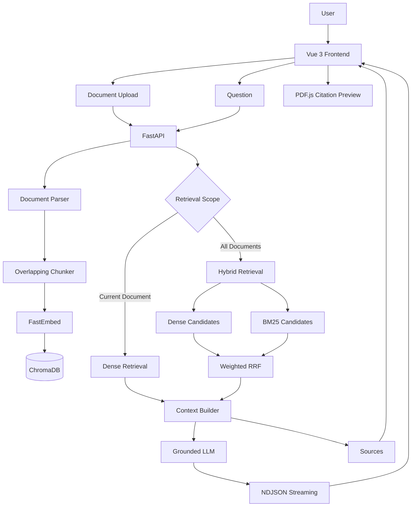

<div align="center">

# 📚 RAGanswer

**基于 Vue 3 + FastAPI 的多文档 RAG 智能问答系统**

支持多格式文档解析、Dense / BM25 Hybrid Retrieval、跨文档问答、流式生成、来源追踪、PDF 引用预览与文本高亮，并完成 Docker Compose 容器化部署。


</div>

---

## ✨ 项目简介

RAGanswer 是一个面向个人知识库场景的多文档 RAG 应用。

用户上传 PDF、DOCX、TXT、Markdown 后，系统会完成：

```text
Document Upload
      ↓
Document Parser
      ↓
Overlapping Chunker
      ↓
FastEmbed
      ↓
ChromaDB
      ↓
Dense / Hybrid Retrieval
      ↓
Context Builder
      ↓
Grounded LLM
      ↓
NDJSON Streaming
      ↓
Answer + Sources
      ↓
PDF Citation Preview / Highlight
```

项目没有直接依赖 LangChain 完成核心 Retrieval Pipeline，而是自行实现：

- Document Parser
- Overlapping Chunker
- Embedding Service
- ChromaDB Vector Store
- Dense Retriever
- BM25 Keyword Retriever
- Weighted RRF Hybrid Retriever
- Context Builder
- Source Metadata
- Retrieval Evaluation

项目重点不是简单调用大模型 API，而是围绕：

> **文档处理 → 检索 → 证据构建 → 生成 → 引用 → 评测 → 部署**

完整实现一套可解释、可评估、可部署的 RAG Workflow。

---

# 🚀 核心功能

## 📄 多格式文档解析

当前支持：

- PDF
- DOCX
- TXT
- Markdown

统一转换为：

```text
Document
├── file_name
├── file_type
└── sections
    ├── text
    └── page
```

其中：

- PDF 按真实页面解析并保留页码；
- DOCX / TXT / Markdown 不伪造页码；
- DOCX 按原始 Block 顺序遍历 Paragraph / Table；
- 表格内容按行展开，保持与上下文的相对位置。

当前暂不支持旧版 `.doc` 文件，也暂未集成 OCR，因此扫描型 PDF 需要具备可提取文本层。

---

## 🧩 Ordered DOCX Parsing

项目开发过程中发现，直接分别读取：

```python
document.paragraphs
document.tables
```

会导致 Word 原始结构被破坏。

例如原始文档可能是：

```text
Paragraph
↓
Table
↓
Paragraph
↓
Table
```

如果先读取所有 Paragraph，再读取所有 Table，就会变成：

```text
All Paragraphs
↓
All Tables
```

从而破坏标题、说明文字与表格之间的语义邻接关系，并进一步影响 Chunking 和 Retrieval。

最终改为直接遍历 DOCX Body XML：

```text
DOCX Body
   ↓
Paragraph / Table
   ↓
保持原始顺序
   ↓
Chunking
```

这一修改在真实跨文档 Retrieval 测试中改善了部分 Evidence Ranking。

---

## ✂️ 自定义 Overlapping Chunker

项目没有依赖 LangChain 完成基础切块，而是自行实现固定窗口 + Overlap Chunking。

默认参数：

```text
chunk_size = 500
overlap    = 100
```

示例：

```text
Chunk 1
0 -------- 500

Chunk 2
     400 -------- 900

Chunk 3
          800 -------- ...
```

Overlap 用于降低关键信息正好位于 Chunk 边界时产生的语义损失。

每个 Chunk 保留：

```text
document_id
file_name
file_type
chunk_index
section_index
page
start_char
end_char
text
```

Metadata 会贯穿：

```text
Vector Store
→ Retrieval
→ Context Builder
→ Sources
→ Citation Preview
```

---

## 🧠 本地多语言 Embedding

Embedding 使用：

```text
FastEmbed
+
ONNX Runtime
```

模型：

```text
sentence-transformers/
paraphrase-multilingual-MiniLM-L12-v2
```

Embedding Dimension：

```text
384
```

文档与 Query 进入同一向量空间：

```text
Document Chunk
      ↓
FastEmbed
      ↓
384-d Vector
```

```text
Question
   ↓
FastEmbed
   ↓
384-d Query Vector
```

EmbeddingService 对上层主要暴露：

```python
embed_texts()
embed_query()
```

因此 Parser、Chunker、Retriever 不直接依赖具体 Embedding Model。

---

## 🗄️ ChromaDB Vector Store

项目使用 ChromaDB 作为本地持久化 Vector Store。

Chunk 写入时保存：

```text
Embedding
+
Original Text
+
Document ID
+
File Name
+
File Type
+
Page
+
Chunk Index
+
Section Index
+
Character Range
```

Dense Retrieval 使用 Cosine Distance，并转换为：

```text
similarity = 1 - distance
```

VectorStore 同时负责：

- Chunk Upsert
- Dense Search
- 文档过滤
- 文档聚合
- Chunk 读取
- 文档删除
- 数据统计

---

# 🔍 双检索策略

项目没有采用一种 Retriever 处理所有场景，而是根据 Retrieval Scope 使用不同策略。

---

## 当前文档：Dense Retrieval

用户明确选择单一文档时：

```text
Question
   ↓
Embedding
   ↓
ChromaDB
   ↓
document_id Filter
   ↓
Dense Top-5
   ↓
Similarity Threshold = 0.45
```

单文档搜索空间较小，因此继续使用 Dense Retrieval。

默认参数：

```text
Top-K = 5
Similarity Threshold = 0.45
```

---

## 全部文档：Hybrid Retrieval

跨文档模式下，Dense Retrieval 曾出现明显的精确技术术语召回问题。

最终采用：

```text
                    Question
                       │
             ┌─────────┴─────────┐
             ↓                   ↓
       Dense Retrieval      BM25 Retrieval
             │                   │
       Top Candidates       Top Candidates
             └─────────┬─────────┘
                       ↓
             Weighted RRF Fusion
                       ↓
                  Final Top-8
                       ↓
                Context Builder
```

当前参数：

```text
Dense Weight = 1.0
BM25 Weight  = 2.0
RRF k        = 60
Candidate K  = 100
Final Top-K  = 8
```

RRF Score：

```text
weight / (rrf_k + rank)
```

Hybrid Candidate 阶段不会使用 Dense Similarity Threshold 提前过滤：

```text
Dense Top Candidates
        +
BM25 Top Candidates
        ↓
Weighted RRF
        ↓
Final Top-8
```

避免低 Dense Score、但关键词匹配较强的证据在融合前被删除。

---

# 🔤 BM25 Keyword Retrieval

项目实现了轻量级 BM25 Keyword Retriever。

英文技术术语按 Token 切分，例如：

```text
Add Field
↓
add
field
```

中文部分使用 Bigram：

```text
数据流
↓
数据
据流
```

BM25 参数：

```text
k1 = 1.5
b  = 0.75
```

BM25 主要用于补充 Dense Retrieval 对以下内容的召回不足：

- 精确技术术语；
- 文件名；
- 类名；
- 函数名；
- Add Field；
- Form Preview；
- Schema；
- RJSF / AJV 等混合技术词。

---

# 📊 Retrieval Evaluation

项目不是凭感觉调整 Top-K、Threshold 或 Hybrid 权重，而是建立人工标注 Retrieval Benchmark。

---

## 单文档 Dense Benchmark

测试集：

```text
21 Questions
├── 11 Positive
└── 10 Negative / Hard Negative
```

生产参数：

```text
Top-K = 5
Similarity Threshold = 0.45
```

最终结果：

| Metric | Result |
| --- | ---: |
| Hit@1 | 72.7% |
| Hit@3 | 90.9% |
| Hit@5 | **100.0%** |
| MRR | **0.836** |
| Negative Rejection | 30.0% |

Dense Retrieval 在正样本上的召回较强：

```text
Hit@5 = 100%
```

但 Negative Rejection 只有：

```text
30%
```

实验说明：

> **Semantic Similarity ≠ Answerability**

部分无法回答的问题依然可以召回语义相似的 Chunk。

因此项目没有单纯不断提高 Similarity Threshold。

如果阈值继续提高：

```text
Negative Rejection ↑
```

但同时可能：

```text
Positive Recall ↓
```

最终采用：

```text
Retriever
→ 保证 Evidence Recall

Grounded LLM
→ 判断 Evidence 是否真正足以回答
```

---

## 跨文档 Retrieval Benchmark

跨文档评测比较：

```text
Dense
BM25
Hybrid RRF 1.25
Hybrid RRF 1.50
Hybrid RRF 2.00
```

最终结果：

| Method | Evidence Hit@5 | Evidence Hit@8 | Evidence MRR |
| --- | ---: | ---: | ---: |
| Dense | 54.5% | 72.7% | 0.348 |
| BM25 | **90.9%** | **90.9%** | **0.798** |
| Hybrid 1.25 | 72.7% | 81.8% | 0.641 |
| Hybrid 1.50 | 72.7% | **90.9%** | 0.644 |
| **Hybrid 2.00** | 72.7% | **90.9%** | **0.652** |

生产环境最终采用：

```text
Dense Weight = 1.0
BM25 Weight  = 2.0
```

而不是 BM25-only。

原因包括：

1. 当前 Benchmark 的 Evidence 判定使用关键词，本身会对 Lexical Retrieval 存在一定优势；
2. 部分语义改写问题仍体现出 Dense Retrieval 的价值；
3. 实际用户 Query 同时存在精确技术术语和自然语言语义问题。

因此最终保留：

```text
Semantic Retrieval
+
Lexical Retrieval
```

两种信号。

---

# 🧪 一个真实的 Retrieval Failure

测试问题：

```text
这个 JSON Schema Builder 项目中，
从点击 Add Field 到 Form Preview 更新，
完整的数据流经过哪些步骤？
```

正确证据包含：

```text
Add Field
↓
FieldConfig
↓
state
↓
Schema
↓
JSON Schema / UI Schema
↓
RJSF + AJV
↓
Form Preview
```

最初 Dense Retrieval：

```text
Evidence Rank = 28
```

修复 DOCX Paragraph / Table 顺序之后：

```text
Evidence Rank = 27
```

说明 Parser 确实存在问题，但并不是 Dense 召回失败的唯一原因。

BM25：

```text
Evidence Rank = 2
```

Weighted RRF Hybrid：

```text
Evidence Rank = 7
```

最终正确证据成功进入：

```text
Top-8 Context
```

页面也从无法完整回答恢复为正确返回：

```text
Add Field
→ FieldConfig
→ State
→ Schema
→ JSON Schema / UI Schema
→ RJSF + AJV
→ Form Preview
```

这也是项目引入 Hybrid Retrieval 的主要工程依据。

---

# 🧪 Reranker 实验与 Trade-off

项目还使用 Cross Encoder 做过独立 Reranker 实验。

实验模型：

```text
BAAI/bge-reranker-base
```

实验结果：

```text
Dense
Hit@1 = 72.7%
Hit@3 = 90.9%
Hit@5 = 100%
MRR   = 0.836
```

```text
Reranker
Hit@1 = 72.7%
Hit@3 = 100%
Hit@5 = 100%
MRR   = 0.833
```

Reranker 可以改善部分候选排序，但同时引入：

```text
约 1 GB 模型缓存
+
约 1 s / Query 的额外延迟
```

并且：

> Reranker 只能重新排序已经召回的 Candidate，无法解决 Dense 根本没有召回正确 Evidence 的问题。

因此当前版本：

```text
Reranker
→ 保留为 Evaluation / Experiment
→ 不进入生产问答链路
```

这是一个主动的工程 Trade-off。

---

# 🛡️ Grounded Generation

Retrieval 完成后，Context Builder 将 Chunk 转换为：

```text
[资料 1]
文件：example.pdf
位置：第 3 页
内容：
...

[资料 2]
文件：example.docx
位置：片段 5
内容：
...
```

Grounded Prompt 要求模型：

- 只能依据提供的参考资料回答；
- 不允许使用模型自身知识补全文档事实；
- 多个 Chunk 可以联合支持一个结论；
- 流程问题可以整合多个直接相关片段；
- 缺少关键步骤时不能自行推断；
- 资料只能支持部分答案时，需要明确区分：
  - 可以确认的内容；
  - 无法确定的内容；
- 使用 `[1]`、`[2]` 等编号标记事实来源。

因此系统形成两层保护：

```text
Retrieval
→ 找 Evidence

Grounded LLM
→ 判断 Evidence 是否真正支持答案
```

---

# 🔗 可追溯 Source Citation

每条回答都会返回结构化 Sources。

Source 包含：

```text
source_id
document_id
file_name
file_type
page
chunk_index
section_index
start_char
end_char
similarity
text
```

Source Metadata 来源于 Retrieval Pipeline，而不是由 LLM 在回答完成后重新推测。

对于 PDF：

```text
真实 Page Number
```

对于 DOCX / TXT / Markdown：

```text
Chunk / Fragment Position
```

不会伪造不存在的页码。

---

# 📄 PDF Citation Preview

PDF Source 支持直接打开原始文档进行引用核验。

前端结构：

```text
SourceCard
   ↓
DocumentPreviewPane
   ↓
PdfViewer
   ↓
PDF.js
```

当前支持：

- PDF 原文预览；
- Citation 页自动跳转；
- 上一页；
- 下一页；
- 页面缩放；
- Fit Width；
- Citation Text Highlight；
- Preview 与当前选中文档状态解耦。

因此在“全部文档”问答中，即使回答引用的是另一份 PDF，也可以直接打开对应来源进行核验。

---

# 🌊 NDJSON 流式问答

完整链路：

```text
LLM Streaming
      ↓
FastAPI
      ↓
NDJSON
      ↓
Nginx
      ↓
Fetch
      ↓
ReadableStream
      ↓
TextDecoder
      ↓
Vue Reactive State
```

后端事件格式：

```json
{"type":"sources","data":[...]}
{"type":"answer","delta":"根据"}
{"type":"answer","delta":"参考资料"}
{"type":"done"}
```

前端可以分别处理：

```text
Sources
Answer Delta
Stream Done
```

从而避免等待完整回答生成后再一次性展示。

---

# 📝 Markdown 安全渲染

模型回答支持：

- 标题；
- 列表；
- 加粗；
- 引用；
- 代码；
- 普通段落。

处理链路：

```text
Markdown
   ↓
marked
   ↓
HTML
   ↓
DOMPurify
   ↓
Safe HTML
   ↓
Vue Render
```

降低直接渲染模型生成 HTML 带来的 XSS 风险。

---

# 🗄️ ChromaDB 作为 Source of Truth

文档真实状态由 ChromaDB 管理，而不是 LocalStorage。

```text
ChromaDB
   ↓
GET /api/rag/documents
   ↓
Frontend Workspace
```

LocalStorage 仅保存：

```text
lastRagDocumentId
```

用于恢复最近选中的文档。

避免出现：

```text
Frontend Document List
≠
Vector Database Documents
```

造成状态漂移。

---

# 💾 原始文档持久化

除了保存 Chunk 和 Embedding，上传后的原始文件也会保存：

```text
rag-server/
└── data/
    ├── chroma/
    └── documents/
        └── {document_id}/
            └── original.xxx
```

这样 Citation Preview 不需要依赖用户再次上传原始文件。

删除文档时：

```text
Delete Request
      ↓
Delete Chroma Chunks
      ↓
Delete Original File
      ↓
Refresh Document List
```

保持：

```text
Vector Store
Original Documents
Frontend State
```

三者一致。

---

# 🏗️ 系统架构



---

# 🔄 RAG Workflow

## 1. Document Ingestion

```text
Upload
  ↓
Temporary File
  ↓
Document Parser
  ↓
Overlapping Chunker
  ↓
FastEmbed
  ↓
Save Original Document
  ↓
ChromaDB Upsert
```

---

## 2. Current Document QA

```text
Question
   ↓
Dense Retriever
   ↓
document_id Filter
   ↓
Top-5
   ↓
Similarity Threshold 0.45
   ↓
Context Builder
   ↓
Grounded LLM
```

---

## 3. All Documents QA

```text
Question
   ↓
┌──────────────────────────┐
│                          │
↓                          ↓
Dense                    BM25
│                          │
└────────────┬─────────────┘
             ↓
        Weighted RRF
             ↓
           Top-8
             ↓
      Context Builder
             ↓
       Grounded LLM
```

---

## 4. Streaming

```text
LLM Delta
    ↓
FastAPI
    ↓
NDJSON
    ↓
Nginx
    ↓
ReadableStream
    ↓
Vue
```

---

# 🛠️ 技术栈

| Layer | Technology |
| --- | --- |
| Frontend | Vue 3、Vite、JavaScript、CSS3 |
| Streaming | Fetch、ReadableStream、TextDecoder |
| Markdown | marked、DOMPurify |
| PDF Preview | PDF.js |
| Backend | Python、FastAPI、Uvicorn |
| Parser | pypdf、python-docx |
| Chunking | Custom Overlapping Chunker |
| Embedding | FastEmbed、ONNX Runtime |
| Embedding Model | paraphrase-multilingual-MiniLM-L12-v2 |
| Vector Store | ChromaDB |
| Semantic Retrieval | Dense Retrieval |
| Keyword Retrieval | Custom BM25 |
| Hybrid Retrieval | Weighted Reciprocal Rank Fusion |
| Evaluation | Custom Retrieval Benchmark |
| Generation | DeepSeek-compatible Chat API |
| Streaming Protocol | NDJSON |
| Deployment | Docker、Docker Compose |
| Reverse Proxy | Nginx |

---

# 📁 项目结构

```text
RAGanswer/
│
├── hellorag/
│   ├── src/
│   │   ├── components/
│   │   │   ├── DocumentQA.vue
│   │   │   ├── SourceList.vue
│   │   │   ├── SourceCard.vue
│   │   │   ├── DocumentPreviewPane.vue
│   │   │   └── PdfViewer.vue
│   │   │
│   │   ├── services/
│   │   │   └── apiService.js
│   │   │
│   │   ├── styles/
│   │   └── views/
│   │       └── MainPage.vue
│   │
│   ├── Dockerfile
│   ├── nginx.conf
│   └── vite.config.js
│
├── rag-server/
│   ├── rag/
│   │   ├── document_parser.py
│   │   ├── chunker.py
│   │   ├── embeddings.py
│   │   ├── vector_store.py
│   │   ├── retriever.py
│   │   ├── keyword_retriever.py
│   │   ├── hybrid_retriever.py
│   │   ├── context_builder.py
│   │   ├── document_storage.py
│   │   ├── ingestion_service.py
│   │   ├── llm_service.py
│   │   └── rag_service.py
│   │
│   ├── evaluation/
│   │   ├── dataset.json
│   │   ├── cross_document_dataset.json
│   │   ├── evaluate_retrieval.py
│   │   ├── evaluate_cross_document.py
│   │   ├── evaluate_hybrid.py
│   │   └── evaluate_reranker.py
│   │
│   ├── data/
│   │   ├── chroma/
│   │   └── documents/
│   │
│   ├── Dockerfile
│   ├── main.py
│   └── requirements.txt
│
├── docker-compose.yml
└── README.md
```

---

# 🔌 API

## GET `/health`

Backend 健康检查。

---

## GET `/api/rag/documents`

获取当前知识库中的真实文档列表。

---

## POST `/api/rag/documents`

上传并索引文档。

完整流程：

```text
UploadFile
   ↓
Parser
   ↓
Chunker
   ↓
Embedding
   ↓
Original File Storage
   ↓
ChromaDB
```

---

## GET `/api/rag/documents/{document_id}/file`

访问原始文档。

主要用于：

```text
Source Citation
→ Original File
→ PDF Preview
```

---

## DELETE `/api/rag/documents/{document_id}`

删除：

```text
Chroma Chunks
+
Original Document
```

---

## POST `/api/rag/qa`

非流式 RAG 问答。

---

## POST `/api/rag/qa-stream`

NDJSON Streaming RAG 问答。

如果调用方没有显式传递 `top_k`：

```text
Current Document → Top-5
All Documents    → Top-8
```

---

# 🐳 Docker / Docker Compose

项目完成了：

```text
Vue
+
Nginx
+
FastAPI
+
ChromaDB Persistence
+
Original Document Persistence
+
FastEmbed Model Cache
```

统一编排。

---

## 部署架构

```text
Browser
   ↓
http://127.0.0.1:8080
   ↓
Frontend Container
   ↓
Nginx :80
   ↓
/api Reverse Proxy
   ↓
Docker Internal Network
   ↓
backend:8000
   ↓
FastAPI
```

Backend 不直接暴露到宿主机端口。

---

## 首次启动

创建 FastEmbed 模型缓存 Volume：

```bash
docker volume create rag-model-cache
```

创建：

```text
rag-server/.env
```

示例：

```env
DEEPSEEK_API_KEY=your_api_key
DEEPSEEK_BASE_URL=https://api.deepseek.com
DEEPSEEK_MODEL=your_model_name
```

然后：

```bash
docker compose up -d --build
```

浏览器访问：

```text
http://127.0.0.1:8080
```

---

## 日常启动

如果没有修改代码：

```bash
docker compose up -d
```

如果只修改 Backend：

```bash
docker compose up -d --build backend
```

如果只修改 Frontend：

```bash
docker compose up -d --build frontend
```

查看状态：

```bash
docker compose ps
```

查看 Backend Log：

```bash
docker compose logs -f backend
```

查看 Frontend / Nginx Log：

```bash
docker compose logs -f frontend
```

---

# 💾 Persistence

## ChromaDB

```text
Host:
./rag-server/data/chroma

Container:
/app/data/chroma
```

## Original Documents

```text
Host:
./rag-server/data/documents

Container:
/app/data/documents
```

## FastEmbed Model

```text
Docker Named Volume:
rag-model-cache

Container:
/tmp/fastembed_cache
```

因此普通：

```bash
docker compose down
docker compose up -d
```

不会清空知识库，也不需要重新完整下载 Embedding Model。

> 涉及持久化数据时，不要随意使用 `docker compose down -v`。

---

# 📌 关键工程决策

## 为什么不直接使用 LangChain？

项目希望真正理解：

```text
Parser
Chunking
Embedding
Retriever
Context
Sources
Evaluation
```

之间的数据流。

因此核心 Retrieval Pipeline 自行实现。

项目可以直接解释：

- Chunk 如何生成；
- Metadata 如何传递；
- Query Embedding 如何产生；
- Dense Retrieval 如何执行；
- BM25 如何打分；
- Weighted RRF 如何融合；
- Sources 如何映射回原始文件；
- Top-K / Threshold 如何通过 Benchmark 调整。

---

## 为什么不是 BM25-only？

当前跨文档 Benchmark 中 BM25 MRR 更高。

但：

1. Benchmark 的 Evidence 判定使用关键词，本身可能更有利于 Lexical Retrieval；
2. 部分语义改写问题 Dense Retrieval 更有价值；
3. 实际用户问题同时包含精确术语和自然语言语义。

因此生产环境保留：

```text
Dense
+
BM25
```

两种 Retrieval Signal。

---

## 为什么不用 Reranker？

Reranker 实验表明：

```text
可以改善部分 Candidate 排序
```

但：

```text
无法解决 Candidate 根本没有被召回的问题
+
额外约 1 GB 模型缓存
+
额外约 1 s Query Latency
```

当前项目规模下收益不足以覆盖增加的复杂度与延迟。

因此：

```text
Reranker
→ Evaluation Experiment
→ Not Production
```

---

## 为什么不继续提高 Similarity Threshold？

实验发现：

```text
Semantic Similarity
≠
Answerability
```

提高 Threshold 虽然可以拒绝更多 Hard Negative，但也会损失正样本召回。

因此最终策略：

```text
Retrieval
→ 优先保证 Evidence Recall

Grounded LLM
→ 判断 Evidence 是否足够支持答案
```

---

# 🔁 项目演进

```text
V1
第三方文档问答 API Prototype

↓

V2
Custom Parser
+
Custom Chunker

↓

V3
FastEmbed
+
ChromaDB
+
Dense Retrieval

↓

V4
Similarity Threshold
+
Context Builder
+
Source Metadata

↓

V5
Grounded LLM
+
NDJSON Streaming

↓

V6
Current / All Documents
+
Document State Synchronization

↓

V7
Original Document Persistence
+
Citation File Access

↓

V8
PDF.js Preview
+
Page Navigation
+
Citation Highlight

↓

V9
Docker
+
Nginx
+
Docker Compose
+
Persistent ChromaDB
+
Persistent Model Cache

↓

V10
Retrieval Benchmark
+
Reranker Experiment

↓

V11
Ordered DOCX Parsing
+
BM25
+
Weighted RRF
+
Hybrid Multi-document Retrieval
```

项目从：

```text
“调用一个文档问答 API”
```

逐步演进为：

```text
“自主实现 Retrieval Pipeline，
并通过 Evaluation 驱动检索优化，
具备来源追踪、Citation Preview、
流式回答与容器化部署能力的 RAG 应用”
```

---

# 🎯 项目亮点

```text
Custom RAG Pipeline
+
Multi-format Parser
+
Ordered DOCX Parsing
+
Overlapping Chunker
+
Local Multilingual Embedding
+
ChromaDB
+
Dense Retrieval
+
BM25
+
Weighted RRF Hybrid Retrieval
+
Retrieval Benchmark
+
Grounded Generation
+
NDJSON Streaming
+
Traceable Sources
+
PDF.js Citation Preview
+
Citation Highlight
+
Document Persistence
+
Docker Compose
+
Nginx Reverse Proxy
```

项目重点不只是“调用 AI”，而是解决：

> **如何让模型找到正确证据、知道证据来自哪里、在证据不足时不编造，并通过 Benchmark 判断 Retrieval 优化是否真正有效。**

---

# 🚧 当前边界

当前版本暂不包含：

- OCR；
- 旧版 `.doc` 文件解析；
- 用户登录；
- 用户级知识库隔离；
- Redis / PostgreSQL 用户系统；
- Production Rate Limit；
- HTTPS / Domain 云部署；
- 对话级 Query Rewrite。

Reranker 已完成实验，但基于延迟、模型体积和收益权衡，没有进入当前 Production Pipeline。

---

# 🔮 后续方向

后续可以继续探索：

- Token-aware / Semantic Chunking；
- Query Rewrite；
- Conversation-aware Retrieval；
- OCR；
- Retrieval Benchmark 扩充；
- BM25 Corpus Cache / Inverted Index；
- Backend Rate Limit；
- Authentication；
- 用户级知识库隔离；
- Linux VPS + HTTPS；
- GitHub Actions CI/CD。

---

# License

本项目用于个人学习、工程实践与 RAG 应用开发研究。