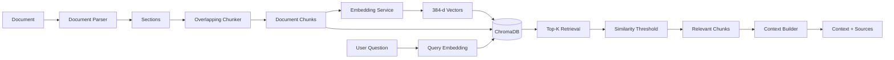
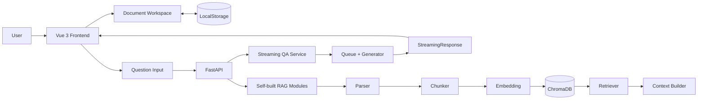

<div align="center">

# 📚 RAG 智能文档问答系统

**基于 Vue 3 + FastAPI 构建的多文档智能问答应用，正在由第三方文档问答能力逐步升级为自建 RAG Pipeline**


</div>

---

## ✨ 项目简介

本项目面向 **“基于个人文档进行智能检索与问答”** 的使用场景，支持用户上传本地文档，并围绕指定文档进行连续提问。

项目最初基于第三方文档问答服务完成文档上传、检索与回答生成，在此基础上已经完成前端工作台、历史文档管理、流式回答、Markdown 渲染等功能。

目前项目正在进一步重构核心 RAG 能力。

后端已经实现一套独立的本地 Retrieval Pipeline：

```text
Document
    ↓
Document Parser
    ↓
Section
    ↓
Overlapping Chunking
    ↓
Multilingual Embedding
    ↓
ChromaDB
    ↓
Query Embedding
    ↓
Top-K Retrieval
    ↓
Similarity Threshold
    ↓
Relevant Context
```

当前自建检索链路已经可以完成：

- PDF / DOCX / TXT / Markdown 文档解析
- PDF 页码信息保留
- 固定窗口 + Overlap 文本切分
- 多语言文本向量化
- ChromaDB 本地持久化
- 指定文档 Top-K 语义检索
- 相似度阈值过滤
- 原始 Chunk 与来源 Metadata 保留
- RAG Context 与 Source 信息构建

真实 PDF 测试中已经完成：

```text
9 个文档 Section
        ↓
24 个 Chunk
        ↓
24 个 384 维向量
        ↓
ChromaDB
        ↓
问题语义检索
        ↓
返回相关原文片段
```

对于明显不存在于文档中的问题，Retriever 可以通过 Similarity Threshold 将低相关度结果过滤，从 Retrieval 阶段减少无依据内容进入后续生成模型。

---

## 🚀 当前核心功能

### 📄 多格式文档处理

当前自建 Parser 支持：

- PDF
- DOCX
- TXT
- Markdown

不同格式统一转换为内部文档结构：

```text
Document
├── file_name
├── file_type
└── sections
    ├── text
    └── page
```

其中 PDF 按页解析，并保留真实页码信息。

DOCX、TXT、Markdown 不伪造页码，在后续引用展示中使用 Chunk / Fragment 信息定位。

> 当前暂不支持旧版 `.doc` 文件。

> 当前暂不支持扫描型 PDF OCR，仅支持可以提取文本内容的 PDF。

---

### ✂️ Overlapping Chunking

项目没有直接依赖 LangChain 等框架完成文本切分，而是自行实现基础 Chunker。

当前默认参数：

```text
chunk_size = 500
overlap = 100
```

Chunk 之间保留一定重叠区域，用于降低关键语义恰好被切割在两个 Chunk 边界时造成的信息损失。

例如：

```text
Chunk 1
start = 0
end   = 500

Chunk 2
start = 400
end   = 900

Chunk 3
start = 800
end   = ...
```

每个 Chunk 同时保留：

```text
chunk_index
section_index
file_name
file_type
page
start_char
end_char
text
```

这些 Metadata 后续可以继续用于：

- 来源追踪
- PDF 页码展示
- 文档范围过滤
- Chunk 定位

---

### 🧠 多语言 Embedding

项目使用：

```text
FastEmbed
+
ONNX Runtime
```

在本地完成 Embedding 推理。

当前模型：

```text
sentence-transformers/paraphrase-multilingual-MiniLM-L12-v2
```

Embedding Dimension：

```text
384
```

即每个文档 Chunk 会被转换为一个 384 维语义向量：

```text
Chunk Text
    ↓
Embedding Model
    ↓
[0.12, -0.08, 0.31, ...]
    ↓
384 Dimensions
```

用户问题同样转换为相同维度的 Query Vector：

```text
Question
    ↓
Embedding
    ↓
384-d Query Vector
```

随后进入同一向量空间进行语义相似度检索。

选择 FastEmbed + ONNX Runtime 的原因主要是降低本地部署和推理成本，使项目可以在无独立 NVIDIA GPU 的普通开发设备上运行 Embedding Pipeline。

Embedding 能力被独立封装在：

```text
EmbeddingService
```

中，上层模块只依赖：

```text
embed_texts()
embed_query()
```

因此后续可以替换 Embedding Model，而无需重写 Parser、Vector Store 和 Retriever。

---

### 🗄️ ChromaDB 向量持久化

项目使用 ChromaDB 作为本地 Vector Store。

数据库采用持久化模式：

```text
rag-server/
└── data/
    └── chroma/
```

每个 Chunk 写入数据库时保存：

```text
Embedding
+
Original Text
+
Document ID
+
File Name
+
File Type
+
Page
+
Chunk Index
+
Section Index
+
Character Range
```

其中 VectorStore 只负责：

```text
向量存储
向量查询
文档删除
数据库统计
```

Embedding 逻辑与 Vector Store 相互解耦。

当前向量检索使用：

```text
Cosine Distance
```

并将查询结果进一步转换为更加直观的：

```text
similarity = 1 - distance
```

---

### 🔍 Top-K Semantic Retrieval

用户输入问题后，系统首先生成 Query Embedding：

```text
Question
    ↓
EmbeddingService
    ↓
Query Vector
```

再通过 ChromaDB 与文档 Chunk Vector 进行相似度检索：

```text
Query Vector
      ↓
ChromaDB
      ↓
Cosine Similarity
      ↓
Top-K
```

Retriever 当前支持：

```text
query
top_k
document_id
similarity_threshold
```

因此既可以：

```text
在指定文档中检索
```

也为后续：

```text
跨文档知识库检索
```

保留扩展能力。

真实文档测试中，对于问题：

```text
实习期间主要完成了哪些工作？
```

Retriever 成功召回了包含以下内容的相关 Chunk：

```text
前端开发
React
Ant Design
表单业务逻辑
前后端接口联调
业务流程分析
项目维护
需求沟通
```

说明当前 Retrieval 已具备基础语义召回能力，而不是简单的字符串完全匹配。

---

### 🛡️ Similarity Threshold

Top-K 并不意味着返回的内容一定与问题真正相关。

即使用户提出一个完全无关的问题，Vector Database 仍然可以从现有向量中找出“最接近”的几个结果。

因此 Retriever 增加：

```text
Similarity Threshold
```

处理过程：

```text
Top-K Results
      ↓
Similarity Filter
      ↓
Relevant Results
```

例如测试问题：

```text
这份报告有没有介绍量子纠缠实验？
```

在当前文档中不存在相关内容。

设置：

```text
similarity_threshold = 0.5
```

以后，检索结果：

```text
result count: 0
```

即：

```text
没有足够相关的文档证据
→ 不将无关 Chunk 继续发送给生成模型
```

这也是项目降低 RAG 无依据回答的重要机制之一。

---

### 📚 Context Builder

Retriever 返回相关 Chunk 后，系统通过 Context Builder 将结果统一整理为后续 LLM 可以理解的参考资料格式。

例如：

```text
[资料 1]
文件：example.pdf
位置：第 2 页
内容：
...

[资料 2]
文件：example.pdf
位置：第 8 页
内容：
...
```

同时单独保留结构化 Sources：

```text
source_id
file_name
page
chunk_index
similarity
text
```

Context 与 Source Metadata 分离设计，为后续实现：

```text
LLM 引用编号
+
前端 Source Card
+
PDF 页码溯源
```

提供数据基础。

---

## 💬 文档问答

现有版本已经具备完整的前端文档问答界面。

用户可以：

- 上传本地文档
- 选择当前文档
- 围绕当前文档输入问题
- 查看连续对话
- 查看 AI 流式生成结果
- 切换历史文档
- 删除历史文档

当前线上问答链路仍保留原第三方文档问答能力。

项目正在将其逐步迁移为：

```text
Question
    ↓
Self-built Retriever
    ↓
Top-K Context
    ↓
LLM
    ↓
Streaming Answer
    ↓
Source Citation
```

迁移过程中保留原有链路，避免在新 RAG Pipeline 尚未全部完成时破坏已有可运行功能。

---

## ⚡ AI 回答流式输出

项目已经实现从后端到浏览器的完整流式输出链路。

原有 AI 服务通过 WebSocket 分段返回生成内容。

后端使用：

```text
WebSocket
    ↓
on_message
    ↓
Queue
    ↓
Generator
    ↓
StreamingResponse
```

前端使用：

```text
Fetch
    ↓
response.body
    ↓
ReadableStream
    ↓
getReader()
    ↓
reader.read()
    ↓
TextDecoder
    ↓
Vue Reactive State
```

因此用户不需要等待模型完整生成回答后才能看到结果。

模型生成内容会逐步显示：

```text
AI：根据

↓

AI：根据文档

↓

AI：根据文档内容……
```

相比完整 JSON Response，可以降低长回答场景下用户等待过程中的感知延迟。

---

## 🌊 后端流式通信设计

WebSocket 与 HTTP Streaming 属于两套不同的通信过程。

如果直接等待：

```python
ws.run_forever()
```

执行完成以后再返回 HTTP Response，则浏览器依然只能一次性获得完整结果。

因此后端采用生产者 / 消费者模式：

```text
WebSocket Thread
       ↓
    Producer
       ↓
      Queue
       ↓
    Consumer
       ↓
    Generator
       ↓
StreamingResponse
```

WebSocket 回调：

```python
message_queue.put(content)
```

不断向 Queue 写入模型生成片段。

Generator：

```python
item = message_queue.get()
yield item
```

持续消费数据。

同时将阻塞的：

```python
ws.run_forever()
```

放入后台线程中执行，从而使 HTTP Streaming 可以与 WebSocket 接收同时进行。

---

## 🖥️ Vue 前端增量渲染

用户发送问题以后，前端首先创建一条空的 AI Message：

```javascript
{
  type: 'ai',
  content: ''
}
```

随后通过：

```javascript
const reader = response.body.getReader();
```

持续消费 HTTP Stream：

```javascript
const { done, value } = await reader.read();
```

二进制数据通过：

```javascript
const decoder = new TextDecoder('utf-8');
```

转换为字符串。

每次收到新的 chunk 后：

```javascript
fullText += chunk;
```

随后更新当前 AI Message：

```javascript
this.conversation[aiMessageIndex].content = fullText;
```

Vue 响应式系统检测到状态变化后自动重新渲染页面，从而实现 AI 回答逐步生成。

---

## 📝 Markdown 安全渲染

AI 回答支持 Markdown 内容展示。

前端使用：

```text
marked
+
DOMPurify
```

处理 AI 返回内容。

流程：

```text
AI Markdown
    ↓
marked
    ↓
HTML
    ↓
DOMPurify
    ↓
安全 HTML
    ↓
Vue Render
```

在支持：

- 标题
- 列表
- 代码
- 引用
- Markdown 格式

的同时，对生成 HTML 进行清理，降低直接渲染模型内容带来的 XSS 风险。

---

## 📋 AI 回答复制

每条 AI Message 提供独立复制操作。

通过：

```javascript
navigator.clipboard.writeText(...)
```

将回答写入系统剪贴板。

复制成功后页面提供短暂反馈状态：

```text
复制
→
已复制
```

避免用户需要手动选择长文本。

---

## ⌨️ 输入交互

问题输入框支持常见 AI 对话应用的键盘行为：

```text
Enter
→
发送问题

Shift + Enter
→
换行
```

避免用户输入多行问题时被 Enter 错误触发发送。

---

## 🗂️ 历史文档管理

前端使用 LocalStorage 保存已上传文档记录。

保存内容包括：

```text
Document ID
File Name
Upload Time
```

用户可以：

- 查看历史文档
- 切换当前文档
- 删除文档记录
- 基于指定文档继续问答

当前文档状态由父级页面统一维护，并通过 Props 向问答组件传递。

避免父子组件同时维护不同的 Document ID 状态造成数据不同步。

---

## 🎨 AI Workspace 界面

当前页面采用知识库 / AI Workspace 风格布局：

```text
┌─────────────────────────────────────────────┐
│                 Top Navigation              │
├──────────────┬──────────────────────────────┤
│              │                              │
│  Documents   │        Current Document      │
│              │                              │
│  History     │        Conversation          │
│              │                              │
│  Upload      │                              │
│              │                              │
│              │        Question Input        │
└──────────────┴──────────────────────────────┘
```

左侧主要用于：

```text
文档管理
文档切换
上传
```

右侧主要用于：

```text
当前文档状态
对话历史
AI 回答
问题输入
```

---

## 🛠️ 技术栈

| 层级 | 技术 |
| --- | --- |
| Frontend | Vue 3、Vite、JavaScript、Fetch API、ReadableStream、TextDecoder、CSS3 |
| UI State | Vue Reactive State、Props / Emit、LocalStorage |
| Markdown | marked、DOMPurify |
| Backend | Python、FastAPI、Uvicorn、StreamingResponse |
| Document Parser | pypdf、python-docx |
| Chunking | Custom Overlapping Chunker |
| Embedding | FastEmbed、ONNX Runtime、Multilingual MiniLM |
| Vector Database | ChromaDB |
| Retrieval | Dense Retrieval、Top-K、Cosine Similarity、Similarity Threshold |
| RAG | Custom Parser / Chunker / Embedding / Retriever / Context Builder |
| Concurrency | Queue、Threading、Generator |
| Network | HTTP、Streaming HTTP、WebSocket |
| Legacy AI Service | 讯飞文档问答服务 |
| Engineering | Git、GitHub、`.env`、Swagger、Conda |

---

## 🏗️ 当前系统架构

### 自建 Retrieval Pipeline



---

### 当前完整应用链路



目前：

```text
Self-built Retrieval
```

已经完成。

下一阶段将：

```text
Context Builder
    ↓
Generic LLM
    ↓
Streaming Response
    ↓
Source Citation
```

接入现有前端问答链路。

---

## 🔄 自建 RAG Retrieval 流程

### 1. Document Parsing

```text
PDF / DOCX / TXT / MD
        ↓
Document Parser
        ↓
Unified Document Structure
```

---

### 2. Chunking

```text
Document Sections
        ↓
500 Character Window
        ↓
100 Character Overlap
        ↓
Chunks + Metadata
```

---

### 3. Embedding

```text
Chunk
    ↓
FastEmbed
    ↓
Multilingual MiniLM
    ↓
384-d Vector
```

---

### 4. Vector Storage

```text
Vector
+
Chunk Text
+
Metadata
    ↓
ChromaDB
    ↓
Persistent Storage
```

---

### 5. Query Retrieval

```text
Question
    ↓
Query Embedding
    ↓
ChromaDB Query
    ↓
Top-K
    ↓
Similarity Threshold
    ↓
Relevant Chunks
```

---

### 6. Context Construction

```text
Relevant Chunks
       ↓
Context Builder
       ↓

[资料 1]
文件：xxx.pdf
位置：第 2 页
内容：...

[资料 2]
文件：xxx.pdf
位置：第 8 页
内容：...

       +

Structured Sources
```

---

## 📁 项目结构

```text
RAGanswer/
│
├── hellorag/                         # Vue 3 Frontend
│   ├── public/
│   │
│   ├── src/
│   │   ├── components/
│   │   │   ├── DocumentQA.vue       # 文档问答、流式输出、复制
│   │   │   └── FileUpload.vue       # 文档上传
│   │   │
│   │   ├── services/
│   │   │   └── apiService.js        # HTTP / Streaming API
│   │   │
│   │   ├── views/
│   │   │   └── MainPage.vue         # 文档 Workspace / 状态管理
│   │   │
│   │   ├── App.vue
│   │   └── main.js
│   │
│   ├── package.json
│   └── vite.config.js
│
├── rag-server/                       # FastAPI Backend
│   │
│   ├── rag/
│   │   ├── __init__.py
│   │   ├── document_parser.py       # PDF / DOCX / TXT / MD 解析
│   │   ├── chunker.py               # Overlapping Chunking
│   │   ├── embeddings.py            # FastEmbed 多语言向量化
│   │   ├── vector_store.py          # ChromaDB 持久化
│   │   ├── retriever.py             # Top-K + Threshold Retrieval
│   │   └── context_builder.py       # Context / Sources 构建
│   │
│   ├── data/
│   │   └── chroma/                  # 本地 Vector Database，不提交 Git
│   │
│   ├── .env.example
│   ├── .gitignore
│   ├── Document_upload.py           # 原文档上传能力
│   ├── Document_Q_And_A.py          # 原问答服务封装
│   ├── main.py                      # FastAPI / StreamingResponse
│   └── requirements.txt
│
└── README.md
```

---

## 🔒 Git Ignore

以下本地文件不会提交到 Git 仓库：

```text
node_modules/
dist/
.env
__pycache__/
.idea/
.vscode/
data/chroma/
```

其中：

- `node_modules/`：前端依赖
- `dist/`：前端构建产物
- `.env`：本地 API 密钥
- `__pycache__/`：Python 缓存
- `.idea/`：JetBrains IDE 配置
- `.vscode/`：VS Code 配置
- `data/chroma/`：本地 Chroma Vector Database

Embedding 模型文件同样使用本地缓存，不提交到 GitHub。

---

## ▶️ 如何运行项目

### 1. 克隆项目

```bash
git clone https://github.com/luojingjing0920/RAGanswer.git
cd RAGanswer
```

---

### 2. 创建 Python 环境

推荐使用 Python 3.11 独立环境运行后端：

```bash
conda create -n rag311 python=3.11 -y
conda activate rag311
```

确认：

```bash
python --version
```

---

### 3. 安装后端依赖

```bash
cd rag-server
python -m pip install -r requirements.txt
```

主要依赖包括：

```text
FastAPI
Uvicorn
pypdf
python-docx
FastEmbed
ONNX Runtime
ChromaDB
python-dotenv
```

---

### 4. 配置环境变量

根据：

```text
.env.example
```

创建：

```text
.env
```

当前旧版问答链路仍需要配置：

```env
XFYUN_APP_ID=your_app_id
XFYUN_API_SECRET=your_api_secret
```

真实 `.env` 已通过 `.gitignore` 排除。

不要将真实 API Secret 提交至 GitHub。

---

### 5. 启动 FastAPI

```bash
python main.py
```

或：

```bash
uvicorn main:app --reload --host 0.0.0.0 --port 8000
```

默认地址：

```text
http://127.0.0.1:8000
```

Swagger：

```text
http://127.0.0.1:8000/docs
```

---

### 6. 启动前端

新建终端：

```bash
cd hellorag
npm install
npm run dev
```

通常访问：

```text
http://localhost:5173
```

---

## 🔌 当前 API

### GET `/health`

FastAPI 健康检查。

返回：

```json
{
  "status": "healthy"
}
```

---

### POST `/api/upload-document`

当前前端文档上传接口。

现阶段仍保留原有上传业务链路。

---

### POST `/api/qa-document`

完整响应模式的文档问答接口。

请求：

```json
{
  "file_id": "your_file_id",
  "question": "请总结这份文档的主要内容"
}
```

返回：

```json
{
  "answer": "..."
}
```

---

### POST `/api/qa-document-stream`

当前前端主要使用的流式问答接口。

请求：

```json
{
  "file_id": "your_file_id",
  "question": "请总结这份文档的主要内容"
}
```

响应：

```text
text/plain; charset=utf-8
```

后端通过：

```text
StreamingResponse
```

持续返回模型生成内容。

---

## 💡 核心实现要点

### 1. Parser / Chunker / Embedding / Retrieval 分层

RAG 模块没有将所有逻辑堆积在一个函数中，而是拆分为：

```text
DocumentParser
      ↓
Chunker
      ↓
EmbeddingService
      ↓
VectorStore
      ↓
Retriever
      ↓
ContextBuilder
```

不同模块职责相互独立。

例如 Embedding Model 发生变化时：

```text
EmbeddingService
```

可以替换，而：

```text
Parser
Chunker
Retriever
ContextBuilder
```

不需要同步重写。

---

### 2. 文档 Metadata 全链路保留

文档在 Parser 阶段即保存：

```text
file_name
file_type
page
```

Chunker 阶段继续增加：

```text
chunk_index
section_index
start_char
end_char
```

Vector Store 保存这些 Metadata。

因此后续从检索结果可以直接获得：

```text
来源文件
页码
Chunk
相似度
```

而不需要在生成答案之后重新猜测来源。

---

### 3. Top-K 与 Threshold 分离

Retriever 并不是简单返回 Vector Database 的 Top-K。

完整流程：

```text
Vector Top-K
    ↓
Similarity Threshold
    ↓
Final Retrieval Results
```

Top-K 负责：

```text
找到相对最接近的内容
```

Threshold 负责：

```text
判断内容是否足够相关
```

两者承担不同职责。

---

### 4. Local Embedding + Remote Generation

当前项目整体目标采用：

```text
Local:
Parser
Chunker
Embedding
Vector Store
Retriever
Citation Metadata

Remote:
Large Language Model Generation
```

避免在普通开发设备本地部署大型生成模型，同时将 RAG 最核心的 Retrieval 能力掌握在自己的服务中。

---

### 5. Producer / Consumer Streaming

旧问答链路中，WebSocket 回调与 HTTP Response 通过 Queue 解耦：

```text
Producer
    ↓
Queue
    ↓
Consumer
```

使第三方 WebSocket 的分段数据可以持续转换为 HTTP Stream。

---

### 6. ReadableStream

浏览器没有使用：

```javascript
await response.json()
```

等待完整结果。

而是直接读取：

```javascript
response.body
```

并通过：

```text
getReader()
↓
reader.read()
↓
TextDecoder
↓
Vue State
```

持续更新 AI Message。

---

### 7. Single Source of Truth

当前文档状态主要由父级 Workspace 管理。

子级问答组件通过 Props 接收当前 Document ID，而不是父子组件各自维护一份文档状态。

避免：

```text
Parent documentId ≠ Child documentId
```

导致问答使用错误文档。

---

### 8. Markdown + DOMPurify

AI 回答先通过 Markdown Parser 转换，再经过 DOMPurify 清理：

```text
Model Output
    ↓
Markdown Parser
    ↓
DOMPurify
    ↓
Safe HTML
```

兼顾回答可读性与前端内容安全。

---

### 9. 敏感配置管理

API Secret 统一通过：

```text
.env
↓
python-dotenv
↓
os.getenv(...)
```

读取。

真实密钥不直接写入 Python 源代码，也不提交 GitHub。

---

## 📊 当前 RAG 验证结果

当前使用一份真实 PDF 文档进行 Retrieval Pipeline 测试。

文档解析结果：

```text
Sections: 9
```

Chunking：

```text
Chunks: 24
```

Embedding：

```text
Vectors: 24
Dimension: 384
```

对于问题：

```text
实习期间主要完成了哪些工作？
```

Top-3 Retrieval 成功返回包含以下语义信息的相关片段：

```text
前端开发
React
Ant Design
表单业务逻辑
前后端接口联调
项目维护
业务理解
需求沟通
```

对于无关问题：

```text
这份报告有没有介绍量子纠缠实验？
```

使用：

```text
similarity_threshold = 0.5
```

最终：

```text
result count: 0
```

验证了当前 Retriever 对明显低相关内容具有基础过滤能力。

---

## 🚧 当前开发阶段

目前已经完成：

```text
Document Parser
        ↓
Overlapping Chunker
        ↓
Multilingual Embedding
        ↓
ChromaDB
        ↓
Top-K Retrieval
        ↓
Similarity Threshold
        ↓
Context Builder
```

现有前端同时已经具备：

```text
Document Workspace
Streaming Response
Markdown Rendering
Copy Answer
Document History
Current Document Switching
```

下一阶段正在将两条能力链正式连接：

```text
Self-built Retriever
        ↓
Context
        ↓
Generic LLM
        ↓
Streaming Response
        ↓
Vue
        ↓
Source Citation
```

---

## 🎯 项目设计目标

本项目的目标并不是简单调用一个“文档问答 API”，而是在已有 AI 问答应用基础上逐步掌握并实现完整 RAG Workflow：

```text
Document Processing
        +
Chunk Strategy
        +
Embedding
        +
Vector Database
        +
Semantic Retrieval
        +
Context Construction
        +
LLM Generation
        +
Streaming
        +
Source Citation
        +
Frontend AI Workspace
```

通过将 Parser、Embedding、Retrieval、Generation 和 Frontend Streaming 分层设计，使项目既能够作为完整的 AI 文档问答应用运行，也能够对每个 RAG 核心模块进行独立理解、调试和替换。

---

## 📌 当前项目特点

```text
Vue 3 AI Workspace
        +
FastAPI Backend
        +
Custom Document Parser
        +
Custom Overlapping Chunker
        +
Local Multilingual Embedding
        +
ChromaDB
        +
Top-K Semantic Retrieval
        +
Similarity Threshold
        +
Context / Source Builder
        +
HTTP Streaming
        +
ReadableStream
        +
Markdown Safe Rendering
        +
Git / GitHub
```

项目目前已经从：

```text
第三方文档问答 API 接入
```

逐步升级为：

```text
自主控制 Retrieval Pipeline 的 RAG 文档问答系统
```

后续继续完成 Generation 与 Retrieval 的整合，并在前端增加可追溯 Source Citation。

---

## License

本项目用于个人学习、技术实践与 RAG 应用开发研究。