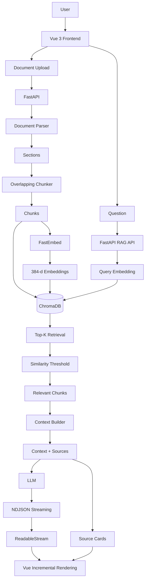

<div align="center">

# 📚 RAG 智能文档问答系统

**基于 Vue 3 + FastAPI 构建的多文档 RAG 智能问答应用**

支持本地文档解析、重叠切块、多语言向量化、ChromaDB 语义检索、跨文档问答、LLM 流式生成与可追溯来源展示。


</div>

---

## ✨ 项目简介

RAG 智能文档问答系统是一个面向个人文档知识库场景的 AI 应用。

用户可以上传 PDF、DOCX、TXT、Markdown 等本地文档，系统会自动完成：

```text
文档解析
   ↓
文本切块
   ↓
Embedding
   ↓
向量存储
   ↓
语义检索
   ↓
上下文构建
   ↓
LLM 生成
   ↓
流式回答
   ↓
来源追踪
```

与仅调用第三方“文档问答 API”的方案不同，本项目的核心 Retrieval Pipeline 由项目自身实现，包括：

- Document Parser
- Overlapping Chunker
- Embedding Service
- ChromaDB Vector Store
- Top-K Retriever
- Similarity Threshold
- Context Builder
- Source Metadata

生成阶段通过远程大语言模型完成，并使用检索结果约束回答范围，从而构成完整的 RAG Workflow。

---

## 🚀 核心功能

### 📄 多格式文档解析

支持：

- PDF
- DOCX
- TXT
- Markdown

统一转换为内部文档结构：

```text
Document
├── file_name
├── file_type
└── sections
    ├── text
    └── page
```

其中：

- PDF 按页解析并保留真实页码；
- DOCX / TXT / Markdown 不伪造页码；
- 非分页文档后续使用 Chunk / Fragment 信息进行来源定位。

> 当前暂不支持旧版 `.doc` 文件。

> 当前暂不包含 OCR，扫描型 PDF 需要先具备可提取文本层。

---

### ✂️ 自定义 Overlapping Chunking

项目没有依赖 LangChain 完成基础切块，而是自行实现固定窗口 + Overlap Chunker。

默认策略：

```text
chunk_size = 500
overlap = 100
```

例如：

```text
Chunk 1
start = 0
end   = 500

Chunk 2
start = 400
end   = 900

Chunk 3
start = 800
end   = ...
```

Overlap 可以降低关键信息恰好位于 Chunk 边界时造成的语义损失。

每个 Chunk 同时保留：

```text
chunk_index
section_index
file_name
file_type
page
start_char
end_char
text
```

这些 Metadata 会贯穿后续 Vector Store、Retrieval 和 Source Citation。

---

### 🧠 本地多语言 Embedding

Embedding 层使用：

```text
FastEmbed
+
ONNX Runtime
```

当前使用多语言模型：

```text
sentence-transformers/paraphrase-multilingual-MiniLM-L12-v2
```

Embedding Dimension：

```text
384
```

处理流程：

```text
Document Chunk
     ↓
Embedding Model
     ↓
384-d Vector
```

用户问题同样转换为：

```text
Question
   ↓
Query Embedding
   ↓
384-d Query Vector
```

随后进入相同向量空间进行语义检索。

选择 FastEmbed + ONNX Runtime，主要是为了降低普通开发设备上的本地推理成本，在没有独立 NVIDIA GPU 的环境下也能够运行 Embedding Pipeline。

Embedding 能力被独立封装，上层模块只依赖：

```text
embed_texts()
embed_query()
```

因此后续可以替换 Embedding Model，而不需要重写 Parser、Chunker 和 Retriever。

---

### 🗄️ ChromaDB 向量存储

项目使用 ChromaDB 作为本地 Vector Store，并使用持久化存储。

```text
rag-server/
└── data/
    └── chroma/
```

每个 Chunk 入库时保存：

```text
Embedding
+
Original Text
+
Document ID
+
File Name
+
File Type
+
Page
+
Chunk Index
+
Section Index
+
Character Range
```

Vector Store 负责：

- Chunk Vector 写入
- 向量查询
- 文档过滤
- 文档删除
- 文档列表聚合
- 数据库统计

Embedding 与 Vector Store 相互解耦。

向量检索使用 Cosine Distance，并将结果转换为更直观的 Similarity：

```text
similarity = 1 - distance
```

---

### 🔍 Top-K Semantic Retrieval

用户输入问题以后：

```text
Question
   ↓
EmbeddingService
   ↓
Query Vector
   ↓
ChromaDB
   ↓
Top-K Retrieval
```

Retriever 支持：

```text
query
top_k
document_id
similarity_threshold
```

因此既支持：

```text
当前文档检索
```

也支持：

```text
全部文档检索
```

全部文档模式下不再附加 `document_id` Filter，可以从整个知识库中进行语义召回。

---

### 🗂️ 当前文档 / 全部文档检索

系统提供两种检索范围：

#### 当前文档

只允许 Retriever 在当前选中文档的 Chunk 中查询：

```text
document_id = current_document_id
```

适合：

- 单篇论文问答
- 单份报告总结
- 当前文件内容分析

#### 全部文档

不限制单一 `document_id`：

```text
document_id = None
```

Retriever 可以在整个知识库中搜索 Top-K Chunk。

适合：

- 跨文档总结
- 多份材料信息对比
- 综合知识库问答

前端会在 Source 区域展示本次回答实际命中了多少个文档。

---

### 🛡️ Similarity Threshold

Vector Database 即使面对完全无关的问题，也始终可以返回“相对最近”的向量。

因此仅使用 Top-K 并不能保证 Retrieval Result 真正相关。

项目在 Retriever 中增加 Similarity Threshold：

```text
Vector Top-K
     ↓
Similarity Threshold
     ↓
Relevant Results
```

Top-K 负责：

```text
找到相对最接近的内容
```

Threshold 负责：

```text
判断内容是否足够相关
```

当没有足够相关的 Chunk 时，系统不会继续把低相关内容作为事实依据发送给生成模型。

最终回答：

```text
根据当前文档无法确定。
```

或：

```text
根据当前知识库无法确定。
```

用于降低模型脱离文档内容回答的概率。

---

### 📚 Context Builder

Retriever 返回 Chunk 后，Context Builder 将结果转换为 LLM 可消费的参考资料。

例如：

```text
[资料 1]
文件：example.pdf
位置：第 2 页
内容：
...

[资料 2]
文件：example.pdf
位置：第 8 页
内容：
...
```

同时保留独立的结构化 Sources：

```text
source_id
file_name
page
chunk_index
similarity
text
```

从而形成：

```text
Retrieval Results
       ↓
Context Builder
       ↓
┌───────────────┐
│ LLM Context   │
└───────────────┘

       +

┌───────────────┐
│ Source Data   │
└───────────────┘
```

Context 用于模型生成。

Source Data 用于前端来源展示。

---

## 🤖 RAG Generation

完整问答链路为：

```text
User Question
      ↓
Query Embedding
      ↓
ChromaDB
      ↓
Top-K Retrieval
      ↓
Similarity Threshold
      ↓
Relevant Chunks
      ↓
Context Builder
      ↓
Prompt
      ↓
Large Language Model
      ↓
Grounded Answer
```

生成阶段通过远程 LLM API 完成。

RAG Prompt 要求模型：

- 优先依据提供的参考资料回答；
- 不将模型自身知识作为文档事实；
- 资料不足时明确说明无法确定；
- 使用 `[1]`、`[2]` 等编号引用来源。

例如：

```text
根据参考资料，项目后端使用 FastAPI 构建 [1]，
并使用 ChromaDB 保存文档向量 [2]。
```

---

## 🌊 NDJSON 流式问答

项目实现了从 LLM 到浏览器的完整流式输出。

整体流程：

```text
LLM Streaming
      ↓
FastAPI
      ↓
NDJSON Event
      ↓
StreamingResponse
      ↓
Fetch
      ↓
ReadableStream
      ↓
TextDecoder
      ↓
Vue Reactive State
```

后端返回的流式事件包括：

```json
{"type":"sources","data":[...]}
{"type":"answer","delta":"根据"}
{"type":"answer","delta":"参考资料"}
{"type":"answer","delta":"，"}
{"type":"done"}
```

其中：

- `sources`：返回本次 Retrieval 的来源；
- `answer`：返回模型生成增量；
- `done`：表示当前流式回答结束。

相比等待完整 JSON 返回，用户可以更早看到模型生成结果，降低长回答场景中的感知等待时间。

---

## 🖥️ Vue 流式增量渲染

前端通过 Fetch 获取 Response 后：

```javascript
const reader =
  response.body.getReader();
```

不断读取：

```javascript
const { done, value } =
  await reader.read();
```

再使用：

```javascript
const decoder =
  new TextDecoder('utf-8');
```

处理增量数据。

AI Message 会随着 `answer delta` 持续更新：

```text
AI：根据

↓

AI：根据参考资料

↓

AI：根据参考资料，项目……
```

从而实现类似主流 AI 产品的逐字 / 分段回答体验。

---

## 🔗 可追溯来源

每条 AI 回答都可以展示对应 Retrieval Sources。

来源卡片包括：

```text
Source ID
File Name
Page / Chunk
Similarity
Original Chunk Text
```

PDF 可以展示真实页码。

TXT / Markdown / DOCX 等不存在稳定页码的文档不会伪造页码，而是使用 Chunk 信息定位。

来源信息来自 Retrieval Pipeline 保存的原始 Metadata，而不是在生成结束以后重新猜测来源。

---

## 📝 Markdown 安全渲染

AI 回答支持 Markdown：

- 标题
- 列表
- 加粗
- 引用
- 代码
- 普通段落

前端使用：

```text
marked
   ↓
HTML
   ↓
DOMPurify
   ↓
Safe HTML
   ↓
Vue Render
```

在保证回答可读性的同时，对模型生成 HTML 进行清理，降低直接 `v-html` 渲染所带来的 XSS 风险。

---

## 📋 回答复制

每条 AI Message 支持一键复制。

通过：

```javascript
navigator.clipboard.writeText(...)
```

写入系统剪贴板。

复制完成后提供短暂状态反馈：

```text
复制
 ↓
√ 已复制
```

---

## ⌨️ 输入交互

问题输入框支持：

```text
Enter
→ 发送问题

Shift + Enter
→ 换行
```

同时在模型正在生成时禁止重复提交。

---

## 🗑️ 文档删除

删除文档时不是单纯删除前端记录。

完整流程：

```text
Frontend Delete
      ↓
DELETE /api/rag/documents/{document_id}
      ↓
FastAPI
      ↓
ChromaDB
      ↓
Delete all chunks
      ↓
Frontend refreshDocuments()
```

因此被删除文档：

- 不再显示在左侧文档列表；
- 不再参与全部文档检索；
- 不会继续作为 Source 被召回。

---

## 🔄 ChromaDB 作为文档 Source of Truth

早期版本使用 LocalStorage 保存已上传文档历史。

随着项目加入：

- 多文档 Retrieval
- 文档删除
- ChromaDB 持久化

仅靠客户端 LocalStorage 可能出现：

```text
Frontend Document List
        ≠
ChromaDB Real Documents
```

例如：

```text
前端已经删除文档
但 ChromaDB 中仍存在旧向量
```

最终版本调整为：

```text
ChromaDB
   ↓
GET /api/rag/documents
   ↓
FastAPI
   ↓
Vue Workspace
```

ChromaDB 成为文档状态的 Source of Truth。

前端启动、上传或删除文档后，都会通过后端重新同步真实文档列表。

LocalStorage 仅保留：

```text
lastRagDocumentId
```

用于记录用户最后一次选中的文档，不再保存知识库真实文档集合。

---

## 🎨 AI Workspace

前端使用知识库 / AI Workspace 风格布局：

```text
┌─────────────────────────────────────────────┐
│                Top Navigation               │
├──────────────┬──────────────────────────────┤
│              │ 当前文档 / 全部文档         │
│  Documents   ├──────────────────────────────┤
│              │                              │
│  Upload      │        Conversation          │
│              │      only this scrolls       │
│  Delete      │                              │
│              ├──────────────────────────────┤
│              │        Question Input        │
└──────────────┴──────────────────────────────┘
```

在问答工作台中：

- Navbar 固定；
- 左侧文档栏固定；
- Retrieval Scope 固定；
- 输入框固定在底部；
- 只有 Conversation History 内部滚动。

---

# 🏗️ 系统架构



---

# 🔄 完整 RAG Workflow

## 1. Document Parsing

```text
PDF / DOCX / TXT / MD
        ↓
Document Parser
        ↓
Unified Document
```

## 2. Chunking

```text
Document Sections
        ↓
500 Character Window
        ↓
100 Character Overlap
        ↓
Chunks + Metadata
```

## 3. Embedding

```text
Chunk
  ↓
FastEmbed
  ↓
Multilingual MiniLM
  ↓
384-d Vector
```

## 4. Vector Storage

```text
Vector
+
Original Text
+
Metadata
      ↓
ChromaDB
```

## 5. Query Retrieval

```text
Question
   ↓
Query Embedding
   ↓
ChromaDB Query
   ↓
Top-K
   ↓
Similarity Threshold
   ↓
Relevant Chunks
```

## 6. Context Construction

```text
Relevant Chunks
       ↓
Context Builder
       ↓

[资料 1]
文件：xxx.pdf
位置：第 2 页
内容：...

[资料 2]
文件：xxx.txt
位置：片段 3
内容：...
```

## 7. Generation

```text
Context
+
Question
   ↓
RAG Prompt
   ↓
LLM
```

## 8. Streaming

```text
LLM Delta
    ↓
FastAPI
    ↓
NDJSON
    ↓
ReadableStream
    ↓
Vue
```

---

# 🛠️ 技术栈

| 层级 | 技术 |
| --- | --- |
| Frontend | Vue 3、Vite、JavaScript、CSS3 |
| Network | Fetch API、ReadableStream、TextDecoder |
| Markdown | marked、DOMPurify |
| Backend | Python、FastAPI、Uvicorn |
| Document Parser | pypdf、python-docx |
| Chunking | Custom Overlapping Chunker |
| Embedding | FastEmbed、ONNX Runtime |
| Embedding Model | paraphrase-multilingual-MiniLM-L12-v2 |
| Vector Database | ChromaDB |
| Retrieval | Dense Retrieval、Top-K、Cosine Similarity |
| Retrieval Guard | Similarity Threshold |
| RAG | Parser、Chunker、Embedding、Retriever、Context Builder |
| Generation | Remote LLM API |
| Streaming | NDJSON、StreamingResponse |
| State | Vue Reactive State、Props / Emit |
| Local State | LocalStorage，仅保存最近选中文档 |
| Engineering | Git、GitHub、Conda、`.env`、Swagger |

---

# 📁 项目结构

```text
RAGanswer/
│
├── hellorag/                         # Vue 3 Frontend
│   │
│   ├── src/
│   │   ├── components/
│   │   │   ├── DocumentQA.vue       # 问答 / Streaming / Sources
│   │   │   └── FileUpload.vue       # 文档上传
│   │   │
│   │   ├── services/
│   │   │   └── apiService.js        # HTTP / NDJSON Streaming
│   │   │
│   │   ├── styles/
│   │   │   ├── main.css             # Workspace 页面样式
│   │   │   └── document-qa.css      # QA 区域样式
│   │   │
│   │   ├── views/
│   │   │   └── MainPage.vue         # Workspace / 文档状态
│   │   │
│   │   ├── App.vue
│   │   └── main.js
│   │
│   ├── package.json
│   └── vite.config.js
│
├── rag-server/                       # FastAPI Backend
│   │
│   ├── rag/
│   │   ├── __init__.py
│   │   ├── document_parser.py       # 多格式解析
│   │   ├── chunker.py               # Overlap Chunking
│   │   ├── embeddings.py            # FastEmbed
│   │   ├── vector_store.py          # ChromaDB
│   │   ├── retriever.py             # Top-K + Threshold
│   │   ├── context_builder.py       # Context / Sources
│   │   ├── ingestion_service.py     # 文档索引流程
│   │   ├── llm_service.py           # LLM Generation
│   │   └── rag_service.py           # RAG Orchestration
│   │
│   ├── data/
│   │   └── chroma/                  # Local Vector DB
│   │
│   ├── .env.example
│   ├── .gitignore
│   ├── main.py                      # FastAPI Entry
│   └── requirements.txt
│
└── README.md
```

---

# 🔌 API

## GET `/health`

检查 FastAPI 服务状态。

```json
{
  "status": "healthy"
}
```

---

## GET `/api/rag/documents`

获取当前 ChromaDB 中真实存在的已索引文档。

返回示例：

```json
{
  "status": "success",
  "count": 2,
  "documents": [
    {
      "document_id": "abc123",
      "file_name": "frontend.txt",
      "file_type": "txt",
      "uploaded_at": "2026-09-12T07:48:00+00:00",
      "chunk_count": 1
    }
  ]
}
```

---

## POST `/api/rag/documents`

上传并索引文档。

处理流程：

```text
UploadFile
   ↓
Temporary File
   ↓
Document Parser
   ↓
Chunker
   ↓
Embedding
   ↓
ChromaDB
```

返回：

```json
{
  "status": "success",
  "document_id": "abc123",
  "file_name": "example.pdf",
  "file_type": "pdf",
  "chunk_count": 24,
  "embedding_dimension": 384
}
```

---

## DELETE `/api/rag/documents/{document_id}`

删除指定文档在 ChromaDB 中的全部 Chunk。

---

## POST `/api/rag/qa`

完整响应模式 RAG 问答。

请求：

```json
{
  "document_id": "abc123",
  "question": "这份文档主要介绍了什么？",
  "top_k": 4,
  "similarity_threshold": 0.05
}
```

全部文档模式可将：

```json
{
  "document_id": null
}
```

发送给后端。

返回：

```json
{
  "status": "success",
  "answer": "...",
  "sources": [],
  "retrieval_count": 4
}
```

---

## POST `/api/rag/qa-stream`

流式 RAG 问答。

Request Body 与 `/api/rag/qa` 类似。

Response 使用 NDJSON：

```text
{"type":"sources","data":[...]}
{"type":"answer","delta":"根据"}
{"type":"answer","delta":"参考资料"}
{"type":"done"}
```

当前 Vue 前端主要使用该接口。

---

# ▶️ 本地运行

## 1. Clone

```bash
git clone https://github.com/luojingjing0920/RAGanswer.git
cd RAGanswer
```

---

## 2. 创建后端环境

推荐 Python 3.11。

```bash
conda create -n rag311 python=3.11 -y
conda activate rag311
```

检查：

```bash
python --version
```

---

## 3. 安装后端依赖

```bash
cd rag-server
python -m pip install -r requirements.txt
```

核心依赖包括：

```text
FastAPI
Uvicorn
pypdf
python-docx
FastEmbed
ONNX Runtime
ChromaDB
python-dotenv
requests
```

---

## 4. 配置环境变量

在：

```text
rag-server/
```

下创建：

```text
.env
```

示例：

```env
DEEPSEEK_API_KEY=your_api_key

DEEPSEEK_BASE_URL=https://api.deepseek.com

DEEPSEEK_MODEL=your_model_name
```

真实 `.env` 不应提交 GitHub。

---

## 5. 启动 FastAPI

```bash
python -m uvicorn main:app --reload --port 8001
```

Backend：

```text
http://127.0.0.1:8001
```

Swagger：

```text
http://127.0.0.1:8001/docs
```

---

## 6. 安装并启动前端

新终端：

```bash
cd hellorag
npm install
npm run dev
```

默认：

```text
http://localhost:5173
```

如果需要修改后端地址，可通过前端环境变量：

```env
VITE_API_BASE_URL=http://127.0.0.1:8001
```

配置。

---

# 🔒 Git Ignore

以下内容不应提交：

```text
node_modules/
dist/

.env

__pycache__/
*.pyc

.idea/
.vscode/

data/chroma/

request.json
```

其中：

- `.env`：真实 API Key；
- `data/chroma/`：本地向量数据库；
- `node_modules/`：前端依赖；
- `__pycache__/`：Python 缓存；
- IDE 配置与本地测试数据不进入仓库。

---

# 💡 核心设计

## 1. RAG 模块分层

后端没有将整个 RAG Pipeline 堆积在一个函数中。

```text
Document Parser
      ↓
Chunker
      ↓
EmbeddingService
      ↓
VectorStore
      ↓
Retriever
      ↓
ContextBuilder
      ↓
LLMService
      ↓
RAGService
```

不同模块职责独立。

例如更换 Embedding Model 时，不需要重新实现 Parser 和 Chunker。

---

## 2. Metadata 全链路保留

Parser 阶段保存：

```text
file_name
file_type
page
```

Chunker 增加：

```text
chunk_index
section_index
start_char
end_char
```

Vector Store 将 Metadata 与 Chunk Vector 一起保存。

因此 Retrieval Result 可以直接获得：

```text
来源文件
页码
Chunk
相似度
原始文本
```

实现可追溯回答。

---

## 3. Top-K 与 Threshold 分离

完整 Retrieval：

```text
Vector Top-K
      ↓
Similarity Threshold
      ↓
Final Results
```

Top-K 与 Threshold 并不是同一个概念。

Top-K：

```text
找到相对最近的内容
```

Threshold：

```text
判断这些内容是否足够相关
```

这样可以避免“虽然不相关，但仍然是数据库中最接近的几个 Chunk”直接进入 LLM。

---

## 4. Local Retrieval + Remote Generation

项目采用：

```text
Local:
Document Parsing
Chunking
Embedding
Vector Store
Retrieval
Source Metadata

Remote:
Large Language Model Generation
```

这样不需要在普通开发设备上部署大型生成模型，同时仍然能够自主控制 RAG 中最关键的 Retrieval Pipeline。

---

## 5. Source of Truth

文档真实状态以：

```text
ChromaDB
```

为准。

而不是：

```text
LocalStorage
```

前端通过：

```text
GET /api/rag/documents
```

同步知识库文档。

LocalStorage 只记录 UI Preference：

```text
lastRagDocumentId
```

避免客户端缓存与向量数据库产生状态漂移。

---

## 6. Structured Streaming

流式响应不是直接返回不可区分的纯文本。

而是使用带事件类型的 NDJSON：

```text
sources
answer
done
```

因此前端可以分别处理：

```text
Retrieval Sources
LLM Delta
Stream Completion
```

为来源卡片、流式回答以及后续更多事件类型保留扩展空间。

---

## 7. 前端 Single Source of Truth

当前 Document ID 和 Retrieval Scope 由上层 Workspace 管理。

DocumentQA 通过 Props / `v-model` 获取状态。

避免：

```text
Parent State
≠
Child State
```

导致 UI 显示一个文档，但实际 Query 使用另一个 `document_id`。

---

# 📊 已完成验证

项目已经使用真实文档完成端到端测试。

包括：

- PDF / DOCX / TXT / MD 上传；
- Parser 文本提取；
- Overlapping Chunking；
- Embedding；
- ChromaDB 持久化；
- 当前文档 Retrieval；
- 全部文档 Retrieval；
- 跨文档回答；
- Similarity Threshold 无关问题过滤；
- RAG Generation；
- NDJSON Streaming；
- Source Citation；
- 文档删除；
- 删除后向量不可再次召回；
- 页面刷新后文档状态同步；
- 长对话区域独立滚动。

其中某次真实 PDF 测试：

```text
Sections: 9
Chunks: 24
Vectors: 24
Embedding Dimension: 384
```

对于文档相关问题可以召回真实内容。

对于明显不存在于知识库中的问题，可以通过 Threshold + Grounded Prompt 返回“无法确定”，而不是直接依赖模型自身知识作答。

---

# 🔁 项目演进

这个项目并不是一次性搭建完成，而是经历了多次架构调整。

```text
V1
第三方文档问答 API 原型
        ↓
V2
自建 Document Parser
+
Overlapping Chunker
        ↓
V3
FastEmbed
+
ChromaDB
+
Top-K Retrieval
        ↓
V4
Similarity Threshold
+
Context Builder
+
Source Metadata
        ↓
V5
Generic LLM Generation
+
Grounded Prompt
        ↓
V6
NDJSON Streaming
+
Vue Incremental Rendering
        ↓
V7
Current / All Documents
+
Cross-document Retrieval
        ↓
V8
Document Delete
+
ChromaDB Source of Truth
+
Frontend State Synchronization
```

项目从：

```text
“调用一个文档问答 API”
```

逐步演进为：

```text
“自主实现 Retrieval Pipeline，
并完成前后端一体化 RAG 应用”
```

---

# 🎯 项目亮点

```text
Vue 3 AI Workspace
        +
Custom Document Parser
        +
Custom Overlapping Chunker
        +
Local Multilingual Embedding
        +
ChromaDB Persistent Vector Store
        +
Top-K Semantic Retrieval
        +
Similarity Threshold
        +
Multi-document Retrieval
        +
Grounded LLM Generation
        +
NDJSON Streaming
        +
ReadableStream
        +
Traceable Sources
        +
Markdown Safe Rendering
        +
ChromaDB Source of Truth
```

项目重点不只是“调用 AI”，而是完整实现和串联：

```text
Document Processing
+
Chunk Strategy
+
Embedding
+
Vector Database
+
Semantic Retrieval
+
Context Construction
+
Generation
+
Streaming
+
Source Citation
+
Frontend Workspace
```

---

## 📌 后续可扩展方向

当前版本已经完成核心 RAG Workflow。

后续如果继续扩展，可以考虑：

- Token-aware Chunking；
- Hybrid Search；
- Reranker；
- Query Rewrite；
- OCR；
- Retrieval Evaluation Dataset；
- 对话级 Query Context；
- 文档预览与 Citation 跳转；
- Docker 部署；
- Redis / PostgreSQL 用户级知识库。

这些功能不属于当前核心版本的必要依赖。

---

## License

本项目用于个人学习、工程实践与 RAG 应用开发研究。