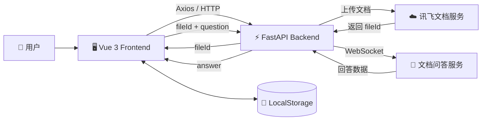

<div align="center">

# 📚 RAG 智能文档问答系统

**基于 Vue 3 + FastAPI + 讯飞文档问答服务实现的前后端分离文档问答应用**


</div>

---

## ✨ 项目简介

本项目面向“**基于本地文档进行智能问答**”的使用场景。

用户上传文档后，前端将文件提交至 FastAPI 后端，由后端调用讯飞文档服务完成文档上传并获取 `fileId`；用户随后围绕当前文档进行提问，后端根据 `fileId + question` 调用文档问答服务，并将结果返回前端展示。

项目目前完成了从：

```text
文档上传
    ↓
文档标识管理
    ↓
基于指定文档问答
    ↓
前端展示回答
```

的一套完整应用链路。

> 当前版本的文档解析、检索和生成能力主要由讯飞文档问答服务提供；本项目主要负责 AI 服务接入、前后端业务链路以及用户交互功能的实现。

---

## 🚀 核心功能

### 📄 多格式文档上传

- 支持 PDF、DOC/DOCX、TXT、MD 等常见文档格式
- 支持用户选择并上传本地文档
- 上传成功后保存服务返回的 `fileId`

### 💬 基于文档的智能问答

- 通过 `fileId` 关联当前上传文档
- 用户可以围绕当前文档内容进行提问
- 后端调用讯飞文档问答服务获取回答
- 将处理后的回答返回前端展示

### 🗂️ 历史文档管理

- 使用 LocalStorage 保存历史文档记录
- 支持查看已上传文档
- 支持切换历史文档继续进行问答

### 🕘 对话记录

- 展示当前文档对应的问答历史
- 保存用户问题与 AI 回答
- 支持清空当前对话

### 🌓 页面交互

- 响应式页面布局
- 支持深色 / 浅色模式
- 文档上传与问答界面分区展示

### 🧩 接口调试

- 基于 FastAPI 提供后端 API
- FastAPI 自动生成 Swagger 接口文档
- 支持通过 Swagger 页面测试后端接口

---

## 🛠️ 技术栈

| 层级 | 技术 |
| --- | --- |
| Frontend | Vue 3、Vite、JavaScript、Axios、CSS3、LocalStorage |
| Backend | Python、FastAPI、Uvicorn |
| Network | HTTP、WebSocket |
| AI / RAG | 讯飞文档问答服务 |
| Engineering | Git、GitHub、`.env`、Swagger |

---

## 🏗️ 系统架构



---

## 🔄 核心业务流程

### 📤 文档上传流程

```text
用户选择文档
    ↓
Vue 3 前端
    ↓
Axios / HTTP
    ↓
FastAPI 上传接口
    ↓
Document_Upload
    ↓
讯飞文档服务
    ↓
返回 fileId
    ↓
前端保存当前文档信息
```

### 💬 文档问答流程

```text
用户输入问题
    ↓
Vue 3 前端
    ↓
fileId + question
    ↓
FastAPI 问答接口
    ↓
Document_Q_And_A
    ↓
WebSocket
    ↓
讯飞文档问答服务
    ↓
后端处理返回结果
    ↓
前端展示回答
```

---

## 📁 项目结构

```text
RAGanswer/
├── hellorag/                     # Vue 3 前端
│   ├── public/
│   ├── src/
│   │   ├── components/           # 页面业务组件
│   │   ├── services/             # API 请求相关逻辑
│   │   ├── views/                # 页面
│   │   ├── App.vue
│   │   └── main.js
│   ├── .gitignore
│   ├── package.json
│   └── vite.config.js
│
├── rag-server/                   # FastAPI 后端
│   ├── .env.example              # 环境变量示例
│   ├── .gitignore
│   ├── Document_upload.py        # 文档上传逻辑
│   ├── Document_Q_And_A.py       # 文档问答逻辑
│   ├── main.py                   # FastAPI 应用入口
│   └── requirements.txt
│
└── README.md
```

以下内容不会提交到 Git 仓库：

```text
node_modules/
dist/
.env
__pycache__/
.idea/
```

其中：

- `node_modules/`：前端依赖
- `dist/`：前端构建产物
- `.env`：本地敏感配置
- `__pycache__/`：Python 缓存文件
- `.idea/`：PyCharm IDE 配置

---

## ▶️ 如何运行项目

### 1. 克隆项目

```bash
git clone https://github.com/luojingjing0920/RAGanswer.git
```

进入项目目录：

```bash
cd RAGanswer
```

---

### 2. 启动后端

进入后端项目：

```bash
cd rag-server
```

安装 Python 依赖：

```bash
python -m pip install -r requirements.txt
```

### 配置环境变量

项目通过 `.env` 保存讯飞 API 配置。

仓库中已经提供：

```text
.env.example
```

在 `rag-server` 目录创建：

```text
.env
```

填写：

```env
XFYUN_APP_ID=your_app_id
XFYUN_API_SECRET=your_api_secret
```

例如目录结构：

```text
rag-server/
├── .env
├── .env.example
├── main.py
└── requirements.txt
```

> ⚠️ `.env` 中包含私密 API 信息，已经通过 `.gitignore` 排除，请勿提交到 GitHub。

### 启动 FastAPI

执行：

```bash
python main.py
```

也可以使用：

```bash
uvicorn main:app --reload --host 0.0.0.0 --port 8000
```

启动成功后，后端默认运行在：

```text
http://127.0.0.1:8000
```

Swagger 接口文档：

```text
http://127.0.0.1:8000/docs
```

健康检查：

```text
http://127.0.0.1:8000/health
```

---

### 3. 启动前端

后端终端保持运行。

重新打开一个终端，进入前端目录：

```bash
cd hellorag
```

安装依赖：

```bash
npm install
```

启动 Vite：

```bash
npm run dev
```

启动成功后，终端通常会输出：

```text
Local: http://localhost:5173/
```

浏览器打开：

```text
http://localhost:5173
```

即可访问项目。

---

### 4. 项目使用顺序

```text
启动 FastAPI 后端
        ↓
启动 Vue 前端
        ↓
进入系统
        ↓
上传本地文档
        ↓
等待服务返回 fileId
        ↓
选择当前文档
        ↓
输入问题
        ↓
查看基于文档生成的回答
```

---

## 🔌 API 说明

### GET `/health`

用于检查后端服务是否正常运行。

返回示例：

```json
{
  "status": "healthy"
}
```

---

### POST `/api/upload-document`

上传本地文档。

调用流程：

```text
Frontend
    ↓
FastAPI
    ↓
Document_Upload
    ↓
讯飞文档服务
```

上传成功后，会获得后续问答需要使用的：

```text
fileId
```

---

### POST `/api/qa-document`

基于指定文档进行问答。

请求核心数据结构：

```json
{
  "file_id": "your_file_id",
  "question": "请总结这份文档的主要内容"
}
```

后端根据：

```text
fileId + question
```

调用文档问答服务，并将回答返回前端。

---

## 💡 实现要点

### 1. 前后端分离

项目采用：

```text
Vue 3
    ↓
Axios
    ↓
FastAPI
    ↓
AI Service
```

的前后端分离结构。

Vue 前端负责：

- 文件选择
- 页面交互
- 问题输入
- 回答展示
- 历史状态管理

FastAPI 后端负责：

- 接收前端请求
- 第三方服务鉴权
- 文档上传
- 文档问答
- AI 返回结果处理

API Secret 保存在后端环境变量中，不直接暴露给浏览器。

---

### 2. HTTP + WebSocket 通信

项目同时使用 HTTP 和 WebSocket。

文档上传：

```text
Frontend
    ↓ HTTP
FastAPI
    ↓ HTTP
讯飞文档上传服务
```

文档问答：

```text
Frontend
    ↓ HTTP
FastAPI
    ↓ WebSocket
讯飞文档问答服务
```

通过后端统一封装第三方服务通信逻辑，使前端只需要调用自己的业务接口。

---

### 3. `fileId` 文档上下文关联

每次文档上传成功后，服务会返回对应的：

```text
fileId
```

后续问答通过：

```text
fileId + question
```

将问题与指定文档关联。

因此不同文档之间可以拥有独立的问答上下文。

---

### 4. LocalStorage 状态持久化

前端通过 LocalStorage 保存：

- 历史文档信息
- 文档相关状态
- 对话历史

使用户在页面刷新或切换文档后，仍然可以查看已有记录。

---


## 🎯 项目总结

该项目实现了一个可实际运行的 **RAG 智能文档问答应用**，完成了从用户上传本地文档到基于指定文档进行 AI 问答的完整业务链路。

项目主要涉及：

- Vue 3 组件化开发
- Axios 前后端接口联调
- FastAPI API 开发
- HTTP / WebSocket 通信
- AI 服务接入
- RAG 应用开发
- LocalStorage 本地状态持久化
- 环境变量与敏感配置管理
- Git / GitHub 工程化管理


## License

本项目用于个人学习与技术实践。